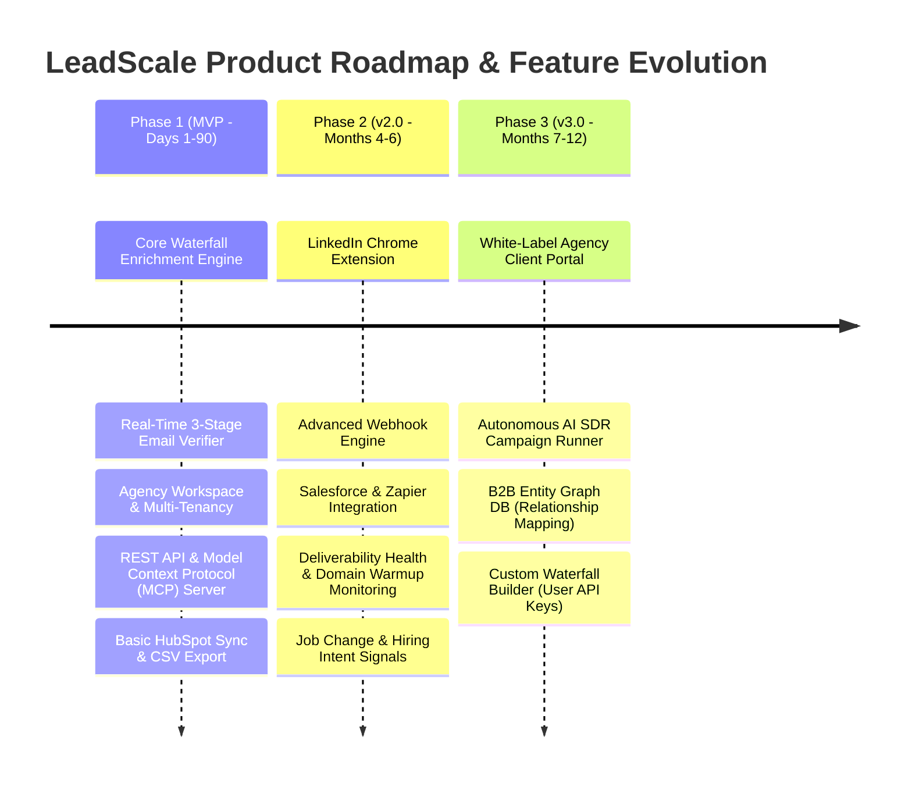
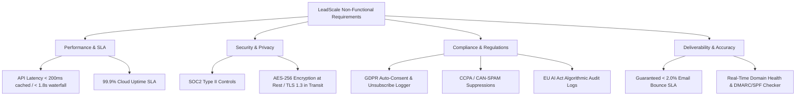
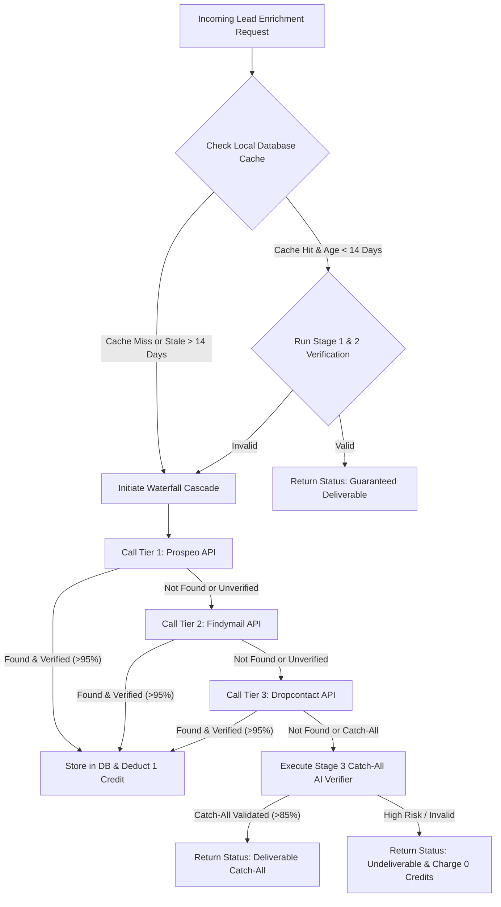

# Product Requirements Document (PRD)
## Project Name: LeadScale Platform (Next-Gen B2B Lead Generation & Waterfall Enrichment)
**Version:** 1.0.0  
**Date:** August 2026  
**Status:** Approved for Engineering & Execution  
**Target Launch:** Q4 2026 (90-Day MVP Delivery)

---

## 1. Executive Summary & Problem Statement

### 1.1 Context & Background
The B2B contact data and sales intelligence market was valued at **$12.8 Billion in 2025** and is projected to surpass **$18.5 Billion by 2028** (CAGR 13.2%). However, traditional single-database platforms (such as Apollo.io, ZoomInfo, Cognism, and Lusha) face severe structural challenges:
* **High Data Decay & Bounce Rates:** Contact data decays at **22.5% per year**. Users of legacy platforms report email bounce rates between **15% and 30%** (Apollo verified list bounce rate ~15–20%; ZoomInfo ~12–18%), causing domain burn, spam box placement, and lost revenue.
* **Opaque & Predatory Pricing:** Enterprise vendors enforce locked-in, annual multi-seat contracts ($15,000–$50,000+/year for ZoomInfo) or complicated "credit per step" traps (such as Clay's multi-step credit consumption model).
* **Missing Agency Multi-Tenancy:** Lead generation agencies and RevOps teams struggle with rigid seat-based pricing, lack of white-label options, and an inability to allocate, track, and reallocate credits across sub-clients.
* **Lack of AI SDR & MCP Native Protocol Support:** Autonomous AI SDRs and conversational agents (Claude, ChatGPT, Microsoft Copilot) require real-time, programmatic, tool-calling APIs (Model Context Protocol - MCP) to query, enrich, verify, and act on lead data without human CSV exports.

### 1.2 Problem Statement
Modern B2B GTM teams and lead gen agencies require a **single, accuracy-first lead-generation platform** that guarantees **<2% email bounce rates**, delivers **flat transparent pricing**, offers **native multi-tenant agency management**, and exposes a **Model Context Protocol (MCP) server** for autonomous AI agent prospecting.

### 1.3 Strategic Solution: LeadScale
LeadScale bridges these gaps through a **hybrid waterfall enrichment architecture**, **3-stage real-time verification engine**, **agency workspace multi-tenancy**, **GDPR/CCPA automated compliance logging**, and **native MCP agent endpoints**.

---

## 2. Target Personas & Jobs-to-be-Done (JTBD)

| Persona | Role & Industry | Key Pain Points | Core Need / Goal | Primary JTBD Statement |
| :--- | :--- | :--- | :--- | :--- |
| **Agency Alex** | Founder / Head of Growth at B2B Lead Gen Agency (10–50 clients) | Client domain burn due to high bounces; managing 20+ client seats; unpredictable software bill. | Single portal to manage 30+ client workspaces, share credits, white-label client reports, guarantee deliverability. | "When I run cold outreach for 20 clients, I want to guarantee <2% bounce rates and control credit allocations across workspaces, so that client domains stay healthy and agency margins stay high." |
| **Sales SDR Sam** | SDR / BDR at B2B Tech SMB | Wasting 3 hours/day manually searching for emails on LinkedIn; emails bouncing; direct dials missing. | Fast, 1-click verified contact lookup with high direct-dial coverage and direct CRM export. | "When I find a target prospect on LinkedIn or search filter, I want 100% deliverable emails and mobile phone numbers instantly, so I can start outreach without manual list cleaning." |
| **RevOps Rachel** | RevOps Engineer / Growth Hacker at Mid-Market SaaS | Clay credit cost bloat; custom Python scripts breaking; API rate limits from legacy vendors. | Reliable, high-throughput REST API and webhooks with automated fallback waterfall enrichment. | "When our product-led signups hit our app, I want an automated waterfall enrichment pipeline via API that returns verified firmographics and contact details within 1.5 seconds." |
| **AI SDR Agent (Autonomous)** | Agentic AI Sales SDR (Claude / ChatGPT / Copilot) | Cannot interact with UI/CSVs; legacy APIs lack standardized function schemas; high latency breaks agent loops. | Standardized Model Context Protocol (MCP) tool endpoints for lead searching, enrichment, deliverability verification, and campaign enrollment. | "When an autonomous AI agent identifies a buyer intent signal, I want to execute MCP tool calls to find verified decision-maker contacts and add them to a sequence without human intervention." |

---

## 3. Product Vision & Scope (MVP vs. v2 vs. v3)

### 3.1 MVP Scope (Phase 1 - 90 Days)
1. **Hybrid B2B Prospecting & Waterfall Enrichment Engine:**
   * Query 10M+ local cached contacts + real-time API waterfall orchestration across top providers (Apollo, Prospeo, Findymail, Dropcontact, Hunter).
   * Smart cascade logic: query local DB first → fall back to API Tier 1 → API Tier 2 → API Tier 3 until valid email/phone is found.
2. **3-Stage Real-Time Email Verification:**
   * Stage 1: Syntax & MX Record Validation.
   * Stage 2: Deep SMTP Handshake (non-blocking async TCP ping).
   * Stage 3: Catch-All AI Pattern & Spam Trap / Honeypot Detector.
   * **Guarantee SLA:** Auto-refund credits for any email that pings invalid or bounces within 14 days.
3. **Agency Multi-Tenancy & Credit Pooling:**
   * Parent Agency Workspace → Child Client Workspaces hierarchy.
   * Granular credit allocation, usage quota limits, and per-workspace permission roles (Owner, Admin, Member, Read-Only).
4. **Developer REST API & MCP Server:**
   * OpenAPI 3.1 REST API endpoints for `/v1/contacts/search`, `/v1/enrich/person`, `/v1/verify/email`.
   * MCP Server exposing tools (`search_leads`, `enrich_contact`, `verify_deliverability`, `create_campaign`) for Claude Desktop, ChatGPT, and custom LLM agents.
5. **Basic Integrations & Compliance:**
   * Native HubSpot 2-way sync & CSV exporter.
   * Automated GDPR / CCPA opt-out database & suppressions check.

---

## 4. Functional Requirements

### 4.1 Module 1: Lead Prospecting & Search
| Requirement ID | Feature Name | Description & Specification | Priority |
| :--- | :--- | :--- | :--- |
| **FR-SEARCH-01** | Multi-Filter Prospect Search | Search contacts by Job Title, Seniority, Department, Company Name, Industry, Employee Count, Revenue, Location, Tech Stack, and Keywords. | Must Have (MVP) |
| **FR-SEARCH-02** | Real-Time Result Streaming | Return contact search results paginated (25/50/100 per page) with latency < 350ms for local queries. | Must Have (MVP) |
| **FR-SEARCH-03** | Save Search & Alert | Save filter criteria and receive daily/weekly automated email alerts when new matching contacts enter system. | Should Have (v2) |

### 4.2 Module 2: Waterfall Enrichment & Real-Time Verification
| Requirement ID | Feature Name | Description & Specification | Priority |
| :--- | :--- | :--- | :--- |
| **FR-ENRICH-01** | Multi-Provider Waterfall Cascade | Cascade enrichment requests sequentially through Local Cache → Prospeo → Findymail → Dropcontact → Hunter until email with >95% confidence score is retrieved. | Must Have (MVP) |
| **FR-ENRICH-02** | 3-Stage Live Verification Engine | Execute real-time SMTP ping, DNS MX lookup, catch-all detection, and disposable email detection on every returned record. | Must Have (MVP) |
| **FR-ENRICH-03** | Phone / Mobile Number Lookup | Retrieve verified direct dials and mobile phone numbers (via Cognism/Kaspr waterfall integrations). | Must Have (MVP) |
| **FR-ENRICH-04** | Bounce Protection Auto-Credit Refund | If an email verified as "Guaranteed Deliverable" pings invalid or bounces during campaign send, system automatically refunds credit. | Must Have (MVP) |

### 4.3 Module 3: Agency Multi-Tenancy & Workspace Management
| Requirement ID | Feature Name | Description & Specification | Priority |
| :--- | :--- | :--- | :--- |
| **FR-AGENCY-01** | Hierarchy Workspaces | Ability for an Agency Account (Parent) to create unlimited Client Workspaces (Children). | Must Have (MVP) |
| **FR-AGENCY-02** | Credit Allocation & Cap Controls | Parent workspace can distribute monthly credits to child workspaces, set rollover rules, or set auto-refill triggers. | Must Have (MVP) |
| **FR-AGENCY-03** | Role-Based Access Control (RBAC) | Enforce roles: `SuperAdmin`, `AgencyOwner`, `WorkspaceAdmin`, `Member`, `Read-Only`. | Must Have (MVP) |
| **FR-AGENCY-04** | Custom Branding / White-Labeling | Whitelabel portal domain (e.g., `leads.agencyname.com`), custom logo, CSS color themes, and export PDF branding. | Could Have (v2) |

### 4.4 Module 4: MCP (Model Context Protocol) Server for AI Agents
| Requirement ID | Feature Name | Description & Specification | Priority |
| :--- | :--- | :--- | :--- |
| **FR-MCP-01** | MCP Server Implementation | Expose STDIO and SSE (Server-Sent Events) MCP endpoints compliant with Anthropic / AAIF Model Context Protocol standard. | Must Have (MVP) |
| **FR-MCP-02** | Agent Prospecting Tools | Implement tools: `search_leads`, `enrich_contact`, `verify_email_deliverability`, `get_company_technographics`. | Must Have (MVP) |
| **FR-MCP-03** | Agent Outreach Tooling | Implement tools: `create_lead_sequence`, `add_contact_to_campaign`, `check_workspace_credits`. | Must Have (MVP) |

---

## 5. Non-Functional Requirements (NFRs)

### 5.1 Performance & Reliability
* **API Latency:** 
  * Local Cache Search Query: `< 200ms` (p95)
  * Real-Time Waterfall Enrichment (Multi-API): `< 1,800ms` (p95)
  * Single Email Verification Ping: `< 400ms`
* **Uptime & Availability:** `99.9%` uptime SLA across API and web dashboard. Multi-region PostgreSQL failover with daily automated encrypted snapshots.
* **Concurrency:** Support minimum `10,000` concurrent API requests per second across worker nodes.

### 5.2 Security & Compliance
* **Data Encryption:** All sensitive data (API keys, workspace secrets, user tokens) encrypted at rest via AES-256-GCM. TLS 1.3 enforced for all in-transit communications.
* **Authentication & Authorization:** JWT with short expiration (15 mins) + HTTP-only refresh tokens. OAuth2.0 / SAML SSO integration for Enterprise/Agency tier.
* **GDPR / CCPA Compliance:**
  * Native B2B Legitimate Interest Assessment (LIA) documentation generation.
  * One-click "Do Not Track / Right-To-Be-Forgotten" automated suppression list across all workspaces.
  * Unsubscribe hash synchronization to prevent re-enrichment of opted-out prospects.
* **EU AI Act Transparency:** Audit trail logged for all AI-generated messaging, intent scoring, and synthetic contact profile matching.

---

## 6. Decision Tree & User Journey Diagrams

### 6.1 Email Verification & Waterfall Decision Tree

---

## 7. Key Performance Indicators (KPIs) & Success Metrics

| Metric Category | Target KPI Metric | Baseline / Benchmark | Target (Year 1) | Measurement Frequency |
| :--- | :--- | :--- | :--- | :--- |
| **Data Quality** | Average Email Bounce Rate | Competitors: 15–25% | **< 1.8%** across all campaigns | Daily Automated Monitor |
| **Data Quality** | Direct Dial Accuracy Rate | Industry Avg: 60% | **> 88%** verified phone hit rate | Weekly Benchmark Audit |
| **Product Adoption** | Active Monthly Workspaces | 0 | **1,200 Workspaces** | Monthly |
| **Product Adoption** | MCP API Agent Calls | 0 | **> 2.5 Million calls/mo** | Real-Time Log Counter |
| **Financial** | Monthly Recurring Revenue (MRR) | $0 | **$120,000 MRR** by Month 12 | Monthly |
| **Financial** | Gross Margin % | Competitor Avg: 50% | **> 68%** (via cache optimization) | Quarterly Finance Review |
| **Retention** | Net Revenue Retention (NRR) | Industry Avg: 105% | **> 122%** (Agency expansion) | Quarterly |
