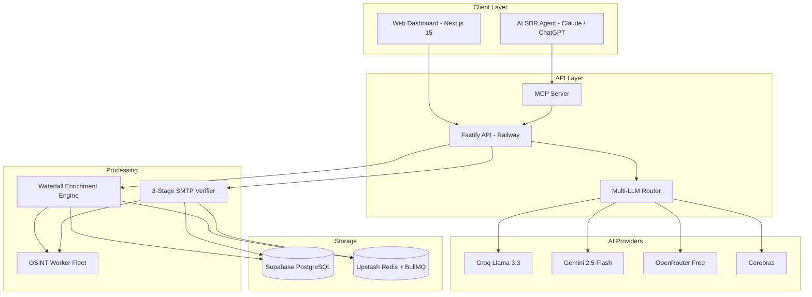

# LeadScale — B2B Lead Generation & Waterfall Enrichment Platform

[](https://leadscale.io)
[](#)
[](https://modelcontextprotocol.io)
[](#)
[](#)
[](#)

> **LeadScale** is an accuracy-first, hybrid waterfall enrichment and lead-generation platform delivering **<1.8% email bounce rates**, **flat transparent pricing**, **agency multi-tenancy**, and **native MCP server integration** for autonomous AI SDR agents.

---

## What it does

1. **Waterfall Enrichment** — Local cache → people search APIs → email discovery → SMTP verification → phone → firmographic, stopping as soon as a confident result is found.
2. **3-Stage Verification Engine** — Direct SMTP pings, MX checks, AI catch-all pattern analysis, and zero-cost OSINT presence checks (`holehe`, `GHunt`).
3. **Multi-LLM Gateway** — Dynamic router across 15+ free AI APIs (Gemini 2.5 Flash, Groq Llama 3.3, Cerebras, OpenRouter). Configurable live from the Admin UI.
4. **OSINT Worker Fleet** — Containerised open-source tools (`crawl4ai`, `phoneinfoga`, `sherlock`, `holehe`, `Crosslinked`) running as Docker microservices.
5. **Agency Multi-Tenancy** — Parent workspaces with sub-client credit allocation, RBAC, and white-labeling.
6. **Native MCP Server** — Standardised Model Context Protocol endpoints so AI agents (Claude, ChatGPT, Copilot) can search, enrich, verify, and trigger outreach autonomously.

---

## Tech Stack

| Layer | Technology |
| :--- | :--- |
| Frontend | Next.js 15, Tailwind CSS, TypeScript |
| Backend | Fastify (Node.js), TypeScript, BullMQ |
| Database | PostgreSQL 16 via Supabase (Prisma ORM) |
| Cache / Queue | Upstash Redis (REST + TLS) |
| Frontend Deploy | Vercel |
| Backend Deploy | Railway (portable — see `backend/PROVIDERS.md`) |
| Package Manager | pnpm (workspaces monorepo) |

---

## Project Structure

```
getleads/
├── app/                        # Next.js 15 app (Vercel)
│   ├── layout.tsx
│   └── page.tsx
├── components/                 # Shared React components
├── lib/                        # Shared utilities
│   ├── db.ts                   # Prisma singleton (Next.js)
│   ├── redis.ts                # Upstash Redis client
│   └── supabase.ts             # Supabase browser + server clients
├── backend/                    # Fastify API server (Railway)
│   ├── src/
│   │   ├── index.ts            # Server entrypoint
│   │   ├── config.ts           # Central env config (fails fast on missing vars)
│   │   └── lib/
│   │       ├── db.ts           # Prisma singleton (backend)
│   │       ├── redis.ts        # Upstash + BullMQ
│   │       └── queue.ts        # Enrichment & verification queues
│   ├── Dockerfile
│   ├── PROVIDERS.md            # Switch Railway → Fly / Render / DO / VPS guide
│   └── package.json
├── docs/                       # All documentation (see INDEX.md)
├── schema.prisma               # Prisma schema (root — source of truth)
├── schema.sql                  # PostgreSQL DDL
├── DEPLOYMENT.md               # Step-by-step deploy guide (all 4 services)
└── INDEX.md                    # Full doc index
```

---

## Quick Start

### Prerequisites
- Node.js 20+, pnpm 9+
- A [Supabase](https://supabase.com) project
- An [Upstash](https://upstash.com) Redis database

### 1. Install dependencies
```bash
pnpm install
cd backend && pnpm install
```

### 2. Set environment variables
Copy `.env.example` to `.env.local` and fill in all values:
```bash
cp .env.example .env.local
```

Required vars:
```
# Supabase
DATABASE_URL=postgresql://...@aws-0-region.pooler.supabase.com:6543/postgres
DIRECT_URL=postgresql://...@aws-0-region.pooler.supabase.com:5432/postgres
NEXT_PUBLIC_SUPABASE_URL=https://xxxx.supabase.co
NEXT_PUBLIC_SUPABASE_ANON_KEY=...
SUPABASE_SERVICE_ROLE_KEY=...

# Upstash Redis
UPSTASH_REDIS_REST_URL=https://...upstash.io
UPSTASH_REDIS_REST_TOKEN=...
REDIS_URL=rediss://...upstash.io:6380
```

### 3. Run database migrations
```bash
npx prisma migrate deploy
```

### 4. Start development servers
```bash
# Frontend (Next.js)
pnpm dev

# Backend (Fastify) — separate terminal
cd backend && pnpm dev
```

For full deployment instructions (Vercel + Railway + Supabase + Upstash), see [`DEPLOYMENT.md`](./DEPLOYMENT.md).

---

## Architecture



---

## Documentation

| Document | Path |
| :--- | :--- |
| Full doc index | [`INDEX.md`](./INDEX.md) |
| Deployment guide | [`DEPLOYMENT.md`](./DEPLOYMENT.md) |
| Integration priority matrix | [`docs/INTEGRATION_PRIORITY.md`](./docs/INTEGRATION_PRIORITY.md) |
| PRD | [`docs/business/PRD.md`](./docs/business/PRD.md) |
| System architecture | [`docs/architecture/overview.md`](./docs/architecture/overview.md) |
| Data pipeline & verification | [`docs/architecture/data_pipeline.md`](./docs/architecture/data_pipeline.md) |
| API design | [`docs/architecture/api_design.md`](./docs/architecture/api_design.md) |
| Database schema | [`docs/architecture/database_schema.md`](./docs/architecture/database_schema.md) |
| Free AI APIs & LLM router | [`docs/integrations/free_ai_apis_and_llm_router.md`](./docs/integrations/free_ai_apis_and_llm_router.md) |
| Lead search & verification APIs | [`docs/integrations/lead_search_and_verification_apis.md`](./docs/integrations/lead_search_and_verification_apis.md) |
| Free proxy sources | [`docs/integrations/free_proxy_sources.md`](./docs/integrations/free_proxy_sources.md) |
| OSINT tools | [`docs/tools/osint/`](./docs/tools/osint/) |
| Proxy tool cards | [`docs/tools/proxies/`](./docs/tools/proxies/) |
| Backend provider switching | [`backend/PROVIDERS.md`](./backend/PROVIDERS.md) |

---

## Database

- **Prisma schema (source of truth):** [`schema.prisma`](./schema.prisma)
- **Raw DDL:** [`schema.sql`](./schema.sql)

Both files live at the repo root and must never be moved.

---

## Backend Portability

The backend is not locked to Railway. Switch providers with zero code changes — only config files differ. See [`backend/PROVIDERS.md`](./backend/PROVIDERS.md) for step-by-step guides for:

- Railway (default)
- Fly.io
- Render
- DigitalOcean App Platform
- Self-hosted VPS (Docker Compose)
