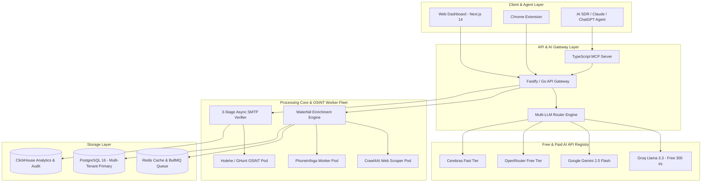

# LeadScale - Next-Gen B2B Lead Generation & Waterfall Enrichment Platform

[](https://leadscale.io)
[](#)
[](https://modelcontextprotocol.io)
[](#)
[](#)
[](#)

> **LeadScale** is an accuracy-first, hybrid waterfall enrichment and lead-generation platform designed to deliver **<1.8% email bounce rates**, **flat transparent pricing**, **agency multi-tenancy**, **admin-configurable Multi-LLM API Gateway routing**, **resilient multi-tier error handling & fallbacks**, and **native Model Context Protocol (MCP) server integration** for autonomous AI SDR agents.

---

## Frontend Apps

| App | Path | Description |
| :--- | :--- | :--- |
| **Landing Page** | [`apps/landing/`](./apps/landing/) | Marketing landing page (Next.js) |
| **Opening Animation** | [`apps/opening/`](./apps/opening/) | Intro/opening animation screen (Next.js) |

---

## 🚀 EXECUTIVE SUMMARY & STRATEGIC BLUEPRINT

The B2B contact data market ($12.8B in 2025 → $18.5B by 2028) is experiencing a fundamental shift. Legacy single-database vendors (ZoomInfo, Apollo.io) suffer from high data decay (22.5%/year), high email bounce rates (15–30%), predatory per-seat contracts, and lack of AI agent compatibility.

LeadScale solves these core friction points through:
1. **Hybrid Waterfall Enrichment:** Local database cache + real-time API cascade (Prospeo → Findymail → Dropcontact → Hunter).
2. **3-Stage Live Verification Engine:** Direct non-blocking SMTP pings, MX checks, AI catch-all pattern analysis, and **zero-cost OSINT email presence checks (`holehe`, `GHunt`)** guaranteeing **<1.8% bounce rates**.
3. **Admin-Configurable Multi-LLM Gateway:** Dynamic LLM router supporting **15+ Free AI APIs** (Google Gemini 2.5 Flash, Groq Llama 3.3, OpenRouter Free, Cerebras, DeepSeek, GitHub Models). Admins can add, track, rate-limit, and remove AI APIs live from the Admin UI.
4. **Resilient Server Management & Fallback Engine:** RFC 7807 Problem Details error handling, circuit breaker state machines, BullMQ exponential backoff queues, and Dead-Letter Queue (DLQ) re-drive.
5. **Containerized Open-Source OSINT Worker Fleet:** Integrates top GitHub open-source tools (`unclecode/crawl4ai`, `sundowndev/phoneinfoga`, `Crosslinked`, `megadose/holehe`, `sherlock`) inside Docker microservices.
6. **Agency Multi-Tenancy:** Parent Agency Workspaces with sub-client workspace credit allocation, role-based access control, and white-labeling.
7. **Native MCP Server:** Standardized Model Context Protocol endpoints allowing AI agents (Claude Desktop, ChatGPT, Microsoft Copilot) to search, enrich, verify, and trigger outreach sequences autonomously.

---

## 📁 MASTER DOCUMENTATION DIRECTORY

| Document Name | Path | Description |
| :--- | :--- | :--- |
| **Product Requirements Document (PRD)** | [`PRD.md`](./PRD.md) | Problem statement, personas, JTBD, MVP scope, functional/non-functional specs, success metrics. |
| **Documentation Structure Guide** | [`docs/README.md`](./docs/README.md) | New organized doc structure for feature-by-feature and tool-by-tool implementation plus suggested code upload mapping. |
| **Feature Docs Index** | [`docs/features/README.md`](./docs/features/README.md) | Per-feature documentation files for implementation tracking and folder targeting. |
| **Tool Docs Index** | [`docs/tools/README.md`](./docs/tools/README.md) | Per-tool documentation files for OSINT and MCP tool integrations. |
| **System Architecture & Tech Stack** | [`docs/architecture.md`](./docs/architecture.md) | Micro-monolith architecture, Next.js/Fastify/Go/Python stack, AI Gateway, OSINT worker fleet. |
| **Data Pipeline & Verification Specs** | [`docs/data_pipeline.md`](./docs/data_pipeline.md) | 5-stage streaming pipeline, 3-stage live SMTP verification, OSINT checks, deduplication, TTL & cache logic. |
| **Server Management & Fallbacks** | [`docs/server_management_error_handling_and_fallbacks.md`](./docs/server_management_error_handling_and_fallbacks.md) | **[NEW]** Request lifecycle, process management, RFC 7807 error formats, circuit breakers, fallback cascades, DLQ retries. |
| **Free AI APIs & Multi-LLM Router** | [`docs/free_ai_apis_and_llm_router.md`](./docs/free_ai_apis_and_llm_router.md) | 15+ Free AI API directory (Groq, Gemini, OpenRouter, Cerebras), AI Gateway Router architecture & admin config schemas. |
| **Open-Source LeadGen & OSINT Tools** | [`docs/opensource_leadgen_and_osint_tools.md`](./docs/opensource_leadgen_and_osint_tools.md) | Catalog & integration framework for top GitHub OSINT repos (`crawl4ai`, `holehe`, `phoneinfoga`, `Crosslinked`, `sherlock`). |
| **API Design & Specifications** | [`docs/api_design.md`](./docs/api_design.md) | REST API endpoints, JSON request/response bodies, AI provider management APIs, rate limits, webhooks. |
| **Integrations & MCP Protocol Spec** | [`docs/integrations.md`](./docs/integrations.md) | HubSpot/Salesforce connectors & complete Model Context Protocol (MCP) server tool definitions for LLMs. |
| **Infrastructure & Hosting Plan** | [`docs/infrastructure.md`](./docs/infrastructure.md) | AWS EKS topology, Aurora PostgreSQL, ClickHouse, proxy pool rotation, cloud cost projections. |
| **Database Architecture & ERD** | [`docs/database_schema.md`](./docs/database_schema.md) | Multi-tenant parent-child schema, AI provider tables, entity relationship diagrams (ERD). |
| **PostgreSQL DDL Script** | [`schema.sql`](./schema.sql) | Production-ready SQL DDL with enums, indexes, triggers, foreign keys, RLS, and `ai_providers` tables. |
| **Prisma ORM Schema** | [`schema.prisma`](./schema.prisma) | Complete Prisma schema file for TypeSafe Node.js/TypeScript backend integration. |
| **Market Analysis & Unit Economics** | [`docs/market_and_unit_economics.md`](./docs/market_and_unit_economics.md) | 2026 market figures, competitor matrix, build-vs-buy framework, pricing tiers & COGS analysis. |
| **90-Day MVP Roadmap & Risk Register** | [`docs/roadmap_and_risk.md`](./docs/roadmap_and_risk.md) | 6-Sprint delivery schedule, team allocation, $194.7k budget, and comprehensive risk mitigations. |

---

## 🛠️ SYSTEM ARCHITECTURE & WATERFALL DATA FLOW



---

## ⚡ QUICK START FOR DEVELOPERS

### 1. Database Setup
Ensure PostgreSQL 16+ is running locally or on AWS Aurora, then execute the DDL script:
```bash
# Clone the repository
git clone https://github.com/01RG0/getleads.git
cd getleads

# Apply the database schema DDL
psql -U postgres -d leadscale_db -f schema.sql
```

### 2. Prisma ORM Client Generation
```bash
# Install dependencies
npm install @prisma/client

# Generate Prisma TypeScript Client
npx prisma generate --schema=schema.prisma
```

### 3. Model Context Protocol (MCP) Server Testing
To test the LeadScale MCP server with Claude Desktop or local AI agents:
```json
// claude_desktop_config.json
{
  "mcpServers": {
    "leadscale": {
      "command": "node",
      "args": ["dist/mcp_server.js"],
      "env": {
        "LEADSCALE_API_KEY": "ls_live_mcp_sample_key_123"
      }
    }
  }
}
```

---

## ✉️ CONTACT & CONTRIBUTING
* **Engineering Lead:** LeadScale Core Team (`dev@leadscale.io`)
* **Repository Branch:** `arena/019ff3e0-getleads`
* **Version:** `1.0.0-GA`
