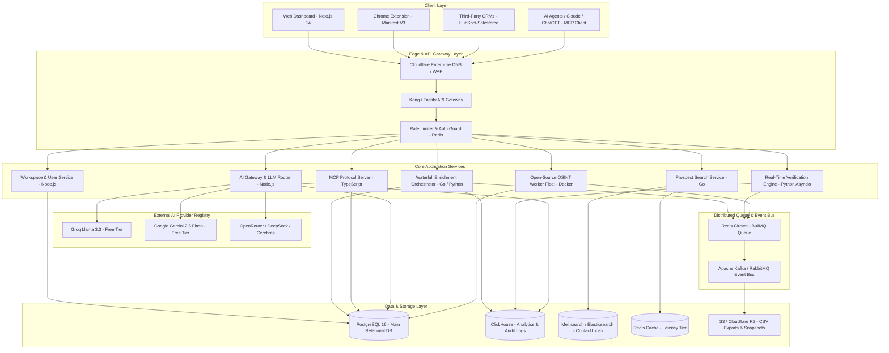

# System Architecture & Tech Stack Document
## Project: LeadScale B2B Platform

---

## 1. Architectural Overview & System Components

LeadScale is designed as a **cloud-native, decoupled, event-driven micro-monolith** optimized for low-latency search queries, distributed asynchronous waterfall enrichment, real-time verification processing, multi-LLM gateway routing, and seamless MCP integration.

---

## 2. Tech Stack Recommendation & Justification

| Layer / Subsystem | Recommended Technology | Alternatives Evaluated | Strategic Justification |
| :--- | :--- | :--- | :--- |
| **Frontend Framework** | **Next.js 14+ (App Router, React 18/19, TypeScript)** | Vue.js, SvelteKit | Standard for modern GTM SaaS. Server Components for instant initial page loads; native support for Shadcn UI & Tailwind CSS. |
| **UI Component Library** | **Shadcn UI + Tailwind CSS + Lucide Icons** | MUI, Ant Design | Fully customizable, accessible, light bundle size, modern clean aesthetic expected by RevOps/Agencies. |
| **API Gateway & Core API** | **Fastify (Node.js/TypeScript) + Go (Golang API)** | Express.js, NestJS | Fastify handles 4x requests/sec vs. Express; Go provides ultra-low-latency execution for search filters and batch processing. |
| **Verification & Scraping Workers** | **Python 3.12 (Asyncio, Playwright, Scrapy)** | Node.js Worker Threads | Superior asynchronous networking libraries (`aiohttp`, `twisted`) for low-level TCP socket pings and distributed proxy rotation. |
| **Open-Source OSINT Workers** | **Docker Containers (Crawl4AI, Holehe, PhoneInfoga)** | Native Python subprocesses | Isolated microservice execution prevents dependency conflicts and isolates GPL/MIT open-source code from core proprietary codebase. |
| **AI Gateway & LLM Router** | **Node.js Gateway / LiteLLM Proxy Wrapper** | Custom Python router | Provides a unified OpenAI-compatible endpoint that dynamically manages, tracks, rate-limits, and falls back across 15+ free/paid LLM APIs. |
| **Primary Relational DB** | **PostgreSQL 16 (AWS Aurora / Supabase)** | MySQL, MongoDB | Native support for Row-Level Security (RLS) for multi-tenancy, JSONB attributes, robust ACID transactions for credit ledger. |
| **Search Engine / Index** | **Meilisearch / PostgreSQL `pg_trgm`** | Elasticsearch | Meilisearch offers ultra-fast sub-50ms typo-tolerant search across millions of records with 1/10th the RAM footprint of Elasticsearch. |
| **Analytics & Audit Logs** | **ClickHouse** | Snowflake, BigQuery | Columnar DB capable of writing 100k events/sec and running sub-second analytics on billions of credit/verification audit logs at low cost. |
| **Queue & Caching** | **Redis Enterprise / DragonflyDB + BullMQ** | RabbitMQ, Celery | BullMQ provides reliable distributed job queueing with delayed retries, rate-limiting per worker, and dead-letter queues. |
| **AI / Agent Protocols** | **Model Context Protocol (MCP) TypeScript SDK** | Custom LangChain wrappers | Anthropic / AAIF open standard. Enables out-of-the-box compatibility with Claude Desktop, Cursor, ChatGPT, and custom AI SDR agents. |
| **Infrastructure & Hosting** | **AWS (EKS / ECS Fargate) + Cloudflare** | Vercel + Render | Fargate/EKS allows scaling background scraping/verification workers independently from API web servers; Cloudflare provides WAF and DDoS mitigation. |

---

## 3. High-Level Subsystem Breakdown

### 3.1 Workspace & Multi-Tenancy Engine
* **Row-Level Security (RLS):** Every PostgreSQL table contains `workspace_id`. Queries are automatically scoped to the authenticated workspace context via database session parameters.
* **Credit Ledger Engine:** Uses double-entry bookkeeping principles. Every credit transaction creates an immutable record in ClickHouse and PostgreSQL, preventing race conditions during concurrent API requests.

### 3.2 Dynamic AI Gateway & LLM Router
* **Admin-Configurable LLM Registry:** Admins can dynamically add, enable, disable, re-prioritize, or remove LLM API providers (`ai_providers` table) via the Admin UI without code deployment.
* **Free AI Tier Maximization:** Routes non-critical tasks (e.g. cold email drafting, firmographic summary, catch-all pattern analysis) to permanent free AI tiers (Groq, Gemini 2.5 Flash, OpenRouter Free, Cerebras, GitHub Models) before falling back to paid OpenAI models.

### 3.3 Containerized Open-Source OSINT Worker Fleet
* **Isolated Execution:** Integrates top open-source lead generation repos (`crawl4ai`, `holehe`, `phoneinfoga`, `Crosslinked`) inside containerized Docker microservices triggered by BullMQ queues.
