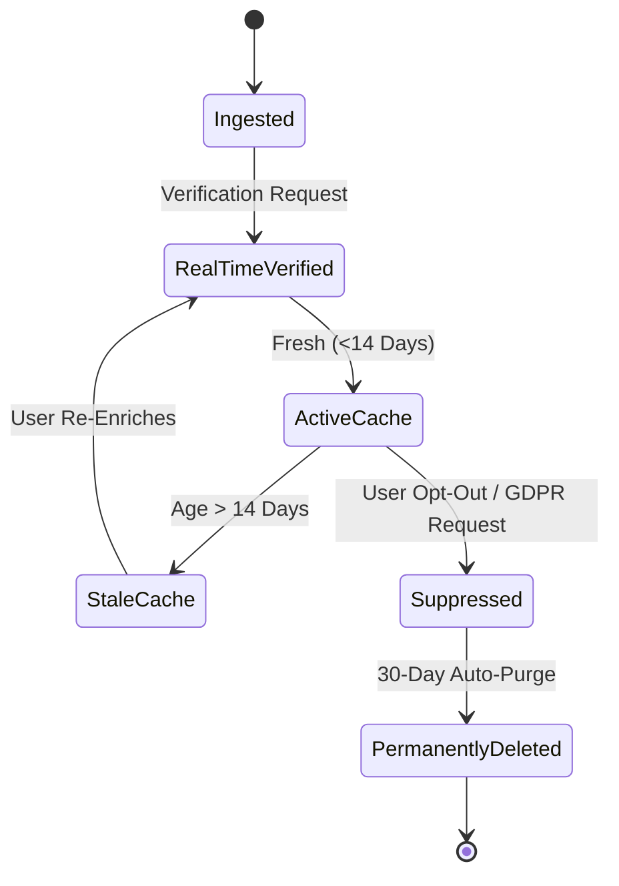

# Data Pipeline Design & Verification Specs
## Project: LeadScale B2B Platform

---

## 1. End-to-End Data Pipeline Overview

The LeadScale data pipeline processes contact and company intelligence through a **5-stage streaming pipeline**:  
`Ingestion / Scraping` → `Waterfall Enrichment` → `3-Stage Real-Time Verification` → `Deduplication & Entity Resolution` → `Storage & Delivery`.

```mermaid
flowchart LR
    subgraph Stage 1: Ingestion
        I1[Web Scrapers]
        I2[Data Licensing Partners]
        I3[User Uploads / Chrome Ext]
    end

    subgraph Stage 2: Waterfall Enrichment
        E1{Check Local Cache}
        E2[Tier 1: Prospeo]
        E3[Tier 2: Findymail]
        E4[Tier 3: Dropcontact]
        E5[Tier 4: Hunter/Apollo]
    end

    subgraph Stage 3: Verification Engine
        V1[Stage 1: Syntax & MX DNS]
        V2[Stage 2: Async SMTP Ping]
        V3[Stage 3: Catch-All AI Verifier]
    end

    subgraph Stage 4: Resolution & Deduplication
        D1[Entity Normalization]
        D2[Fuzzy Match Hash]
        D3[Quality Scoring]
    end

    subgraph Stage 5: Storage & Delivery
        S1[(PostgreSQL Primary)]
        S2[(ClickHouse Audit)]
        S3[REST API / MCP / Webhooks]
    end

    I1 --> E1
    I2 --> E1
    I3 --> E1

    E1 -- Miss --> E2
    E2 -- No Match --> E3
    E3 -- No Match --> E4
    E4 -- No Match --> E5

    E1 -- Hit --> V1
    E2 -- Match --> V1
    E3 -- Match --> V1
    E4 -- Match --> V1
    E5 -- Match --> V1

    V1 --> V2
    V2 --> V3
    V3 --> D1
    D1 --> D2
    D2 --> D3
    D3 --> S1
    D3 --> S2
    S1 --> S3
```



---

## 2. Waterfall Enrichment Architecture & Provider Logic

### 2.1 Provider Waterfall Priority Matrix

| Tier | Provider Name | Primary Focus | API Unit Cost | SLA / Latency | Typical Match Rate |
| :--- | :--- | :--- | :--- | :--- | :--- |
| **Tier 0** | **LeadScale Local DB Cache** | Historical Verified Data (<14d old) | `$0.000` | `< 15ms` | ~25–35% (Grows over time) |
| **Tier 1** | **Prospeo API** | High-precision email finding | `$0.010` | `< 450ms` | 72–80% |
| **Tier 2** | **Findymail API** | Deliverability-first, LinkedIn exports | `$0.019` | `< 600ms` | 65–75% |
| **Tier 3** | **Dropcontact API** | GDPR-native European contacts | `$0.022` | `< 800ms` | 70–78% (EU focus) |
| **Tier 4** | **Hunter / Apollo API** | Domain pattern fallback | `$0.015` | `< 500ms` | 55–65% |

### 2.2 Cascade Execution Algorithm (Pseudo-code)

```python
async def execute_waterfall_enrichment(first_name: str, last_name: str, domain: str, company: str):
    # Step 1: Query Local Redis/Postgres Cache
    cache_key = generate_cache_key(first_name, last_name, domain)
    cached_record = await redis_client.get(cache_key)
    
    if cached_record and cached_record.is_fresh(max_age_days=14):
        if cached_record.verification_status == "guaranteed_deliverable":
            return cached_record, Source.LOCAL_CACHE, cost=0.0

    # Step 2: Iterate through Provider Waterfall
    providers = [ProspeoProvider(), FindymailProvider(), DropcontactProvider(), HunterProvider()]
    
    for provider in providers:
        try:
            result = await provider.enrich(first_name, last_name, domain, company)
            if result and result.email:
                # Execute Live Verification on Candidate
                verification = await real_time_verifier.verify(result.email, domain)
                if verification.status in ["guaranteed_deliverable", "deliverable_catch_all"]:
                    # Store in Cache and DB
                    enriched_data = assemble_payload(result, verification)
                    await save_to_cache_and_db(cache_key, enriched_data)
                    return enriched_data, provider.name, provider.unit_cost
        except ProviderTimeoutException:
            continue # Fall through to next provider
            
    return {"status": "not_found"}, Source.NONE, cost=0.0
```

---

## 3. 3-Stage Real-Time Verification Engine Specifications

### 3.1 Stage 1: Syntax & MX Record Validation
* **Syntax Regex Verification:** Standard RFC 5322 compliance checking. Filters out invalid characters, missing `@` symbols, double dots, or improper TLDs.
* **DNS Query:** Performs non-blocking async DNS lookup (`A` and `MX` records). Verifies that the recipient domain has active mail servers configured.
* **Disposable & Spam Trap Filter:** Checks domain against a database of 45,000+ known disposable email services (e.g., TempMail, GuerrillaMail) and high-risk honeypot seeds.

### 3.2 Stage 2: Asynchronous SMTP Handshake
* **Non-blocking TCP Ping:** Establishes a socket connection to target mail server on port 25 or 587.
* **SMTP Conversation Stream:**
  1. `HELO mail.leadscale.io`
  2. `MAIL FROM: <verify-bounce@leadscale.io>`
  3. `RCPT TO: <target.email@company.com>`
  4. Inspect Server Response Code:
     * `250 2.1.5 Ok`: Recipient exists -> **Guaranteed Deliverable**.
     * `550 5.1.1 User unknown`: Recipient invalid -> **Undeliverable**.
     * `451 / 421`: Rate limited or Greylisted -> Escalate to Stage 3.
  5. `QUIT` (Connection terminated gracefully before `DATA` command is sent; no email is delivered).

### 3.3 Stage 3: Catch-All AI Pattern & Deliverability Scoring
* **Catch-All Detection:** If target server responds `250 OK` to random non-existent email pings (e.g., `xyz987qwe@company.com`), domain is flagged as a **Catch-All Domain**.
* **AI Pattern Scoring Engine:**
  * Analyzes historical delivery data for domain syntax (`{first}.{last}`, `{f}{last}`, `{first}`).
  * Cross-references recipient's LinkedIn activity, MX server provider (Google Workspace vs. Microsoft 365 vs. Self-hosted Proofpoint), and MX age.
  * Assigns a **Confidence Score (0–100%)**:
    * `Score >= 85%`: Status = **Deliverable Catch-All** (Safe for outreach).
    * `Score < 85%`: Status = **Risky / Undeliverable** (Do not bill user).

---

## 4. Deduplication & Entity Resolution Engine

To maintain high data integrity across multi-provider sources, LeadScale implements **Deterministic and Probabilistic Matching**:

### 4.1 Match Key Rules
1. **Deterministic Match Key:**  
   `SHA256(LOWER(first_name) + "_" + LOWER(last_name) + "_" + LOWER(normalized_company_domain))`
2. **Probabilistic Fuzzy Matching:**
   * Utilizes Jaro-Winkler string similarity and Levenshtein distance on company names and titles (e.g., "VP Sales" == "Vice President of Sales").
   * Merges duplicate contact profiles while retaining data provenance (tracking which provider supplied which field attribute).

---

## 5. Data Lifecycle & TTL Management



* **Freshness SLA:** Verified status remains valid in active cache for **14 days**. After 14 days, any new user request triggers a micro-reverification ping.
* **GDPR Compliance Purge:** When an opt-out request is received, contact details are hashed (`SHA-256`) and placed in a global `suppression_list` table. All personally identifiable information (PII) is permanently purged within 24 hours.
