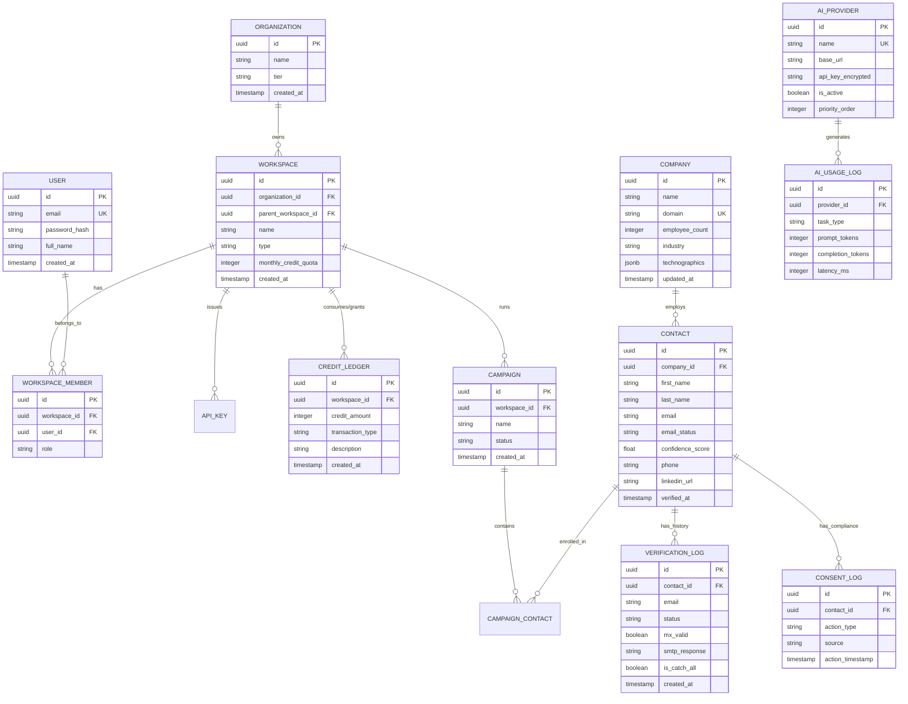

# Database Schema Specification & ERD
## Project: LeadScale B2B Platform

---

## 1. Relational Database Overview & Multi-Tenancy Architecture

The LeadScale database architecture uses PostgreSQL 16+ as the transactional store. Multi-tenancy is implemented through a **Parent-Child Workspace Hierarchy** with Row-Level Security (RLS) policies.

### Core Entity Relationship Diagram (ERD)

---

## 2. Table Field Specifications

### 2.1 `organizations` & `workspaces`
* `organizations`: Top-level billing account entity (e.g. Agency or Enterprise company).
* `workspaces`: Sub-tenant environment. Supports nested hierarchies (`parent_workspace_id` points to another workspace ID for agency-client multi-tenancy).

### 2.2 `contacts` & `companies`
* `contacts.email_status` Enum: `unverified`, `guaranteed_deliverable`, `deliverable_catch_all`, `risky`, `invalid`.
* `contacts.confidence_score`: Float between 0.00 and 100.00 representing deliverability likelihood.

### 2.3 `ai_providers` & `ai_usage_logs` (Multi-LLM Management)
* `ai_providers`: Admin-configurable AI/LLM API registry (Groq, Gemini Flash, OpenRouter, DeepSeek, Cerebras, etc.). Allows admins to add, track, re-prioritize, or remove LLM APIs dynamically.
* `ai_usage_logs`: Real-time audit trail tracking prompt/completion tokens, latency, cost savings, and task execution success per AI provider.

### 2.4 `credit_ledger`
* Immutable double-entry ledger.
* `transaction_type` Enum: `monthly_grant`, `purchase`, `enrichment_deduction`, `verification_deduction`, `bounce_refund`, `agency_sub_allocation`.
