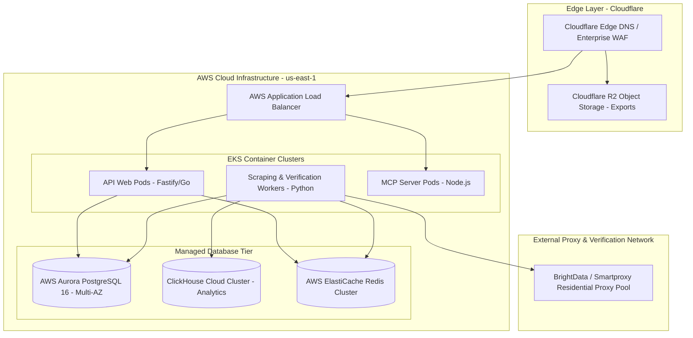

# Infrastructure & Hosting Plan
## Project: LeadScale B2B Platform

---

## 1. Cloud Infrastructure Architecture

LeadScale is deployed on **Amazon Web Services (AWS)** backed by **Cloudflare Enterprise** for edge delivery, WAF protection, and Global DNS acceleration.

---

## 2. Component Specifications & Compute Topology

### 2.1 EKS Container Pod Allocation
* **API Web Services (`Fastify / Go`):**  
  * 3x `c6i.xlarge` nodes (4 vCPU, 8GB RAM per node) in multi-AZ deployment.
  * Auto-scales horizontally based on HTTP request throughput (>500 req/sec triggers scale-out).
* **Scraping & Verification Async Workers (`Python Asyncio`):**  
  * 6x `c6i.2xlarge` nodes (8 vCPU, 16GB RAM per node).
  * Auto-scales based on Redis BullMQ queue length (if pending jobs > 1,000, worker pods scale up dynamically).
* **MCP Protocol Server Pods (`Node.js / TypeScript`):**  
  * 2x `t4g.medium` nodes (2 vCPU, 4GB RAM) dedicated to handling STDIO/SSE agent streaming connections.

---

## 3. Database Infrastructure & Backup Strategy

### 3.1 PostgreSQL (Aurora Multi-AZ)
* **Configuration:** Primary DB instance (`db.r6g.xlarge`) + 1 Auto-Scaling Read Replica (`db.r6g.xlarge`).
* **Backup & Disaster Recovery:** Continuous Point-in-Time Recovery (PITR) with 35-day retention. Daily automated cross-region encrypted snapshots to AWS `us-west-2`.

### 3.2 ClickHouse Analytics
* **Cluster Spec:** 3-node ClickHouse cluster handling event logging, credit audit entries, and verification metric timeseries.
* **Throughput:** Configured to handle >100,000 write operations per second with zero locking.

---

## 4. Residential Proxy Rotation & Anti-Bot Strategy

To execute high-deliverability live SMTP handshakes and public web extraction without IP bans:
1. **Proxy Pool Mix:**  
   * **Residential Proxies (BrightData / Smartproxy):** 80% weight for SMTP TCP pings and domain MX verification (uses sticky IP sessions per domain).
   * **Datacenter Proxies (AWS / DigitalOcean):** 20% weight for fast firmographic API lookups.
2. **IP Health Monitoring Engine:**  
   * Automatically monitors IP reputation against Spamhaus, Barracuda, and SORBS blacklists.
   * Quarantines any proxy IP experiencing >3 consecutive TCP timeouts.

---

## 5. Cost Projections & Infrastructure Budget

### 5.1 Infrastructure Monthly Cost Breakdown

| Resource Component | Scale Tier 1 (100 Workspaces / ~1M lookups/mo) | Scale Tier 2 (1,000 Workspaces / ~15M lookups/mo) |
| :--- | :--- | :--- |
| **AWS EKS Compute Nodes** | $320 / mo | $1,850 / mo |
| **AWS Aurora PostgreSQL (Multi-AZ)** | $280 / mo | $890 / mo |
| **AWS ElastiCache Redis** | $90 / mo | $340 / mo |
| **ClickHouse Cloud Analytics** | $120 / mo | $650 / mo |
| **Cloudflare Enterprise & Storage** | $100 / mo | $450 / mo |
| **Residential Proxy Pool Network** | $250 / mo | $1,600 / mo |
| **Total Cloud Infra Cost** | **$1,160 / mo** | **$5,780 / mo** |
| **Infra Cost Per Workspace** | **$11.60 / workspace** | **$5.78 / workspace** |
