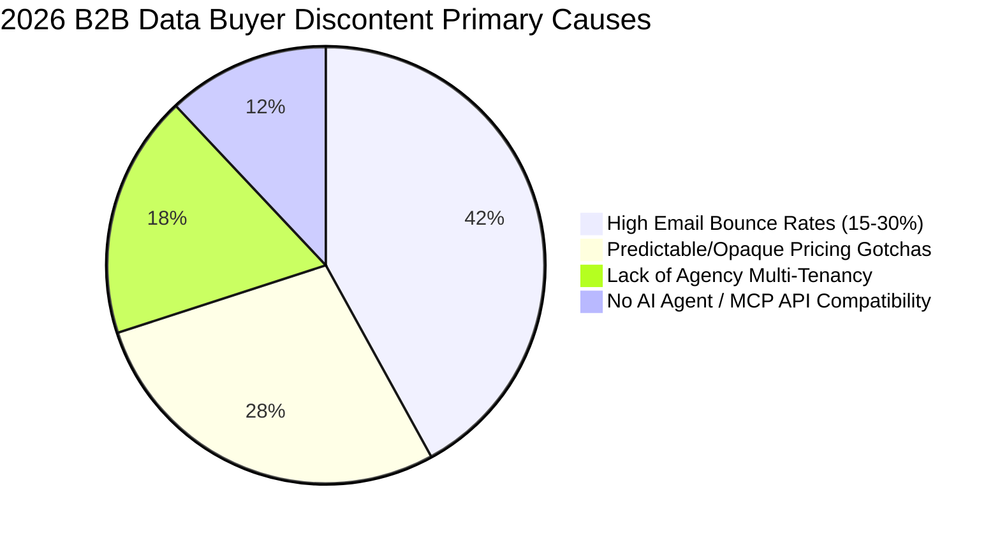
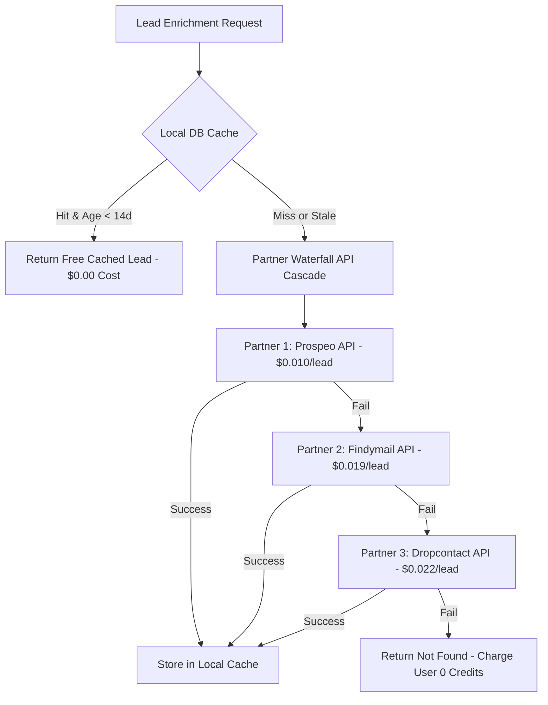

# 2026 Market Analysis, Unit Economics & Build-vs-Buy Framework
## Project: LeadScale B2B Platform

---

## 1. 2026 B2B Contact Data Market Size & Macro Trends

### 1.1 Market Size & Growth Trajectory
The global B2B Sales Intelligence and Contact Data Software market reached **$12.8 Billion in 2025** and is projected to expand to **$18.5 Billion by 2028** at a CAGR of **13.2%**.



### 1.2 Key 2026 Industry Shifts
1. **The Rise of Autonomous AI SDRs & Agentic Workflows:**  
   In 2026, AI agents (built on Anthropic's Model Context Protocol - MCP and OpenAI frameworks) account for **>20% of cold prospecting queries**. Legacy platforms lack structured tool-calling endpoints for agents.
2. **Shift From Single-Source Databases to Waterfall Orchestration:**  
   Single static contact databases suffer from **22.5% annual decay**. Buyers increasingly demand hybrid waterfall enrichment (e.g., Clay, SyncGTM, Deepline) that cascades across multiple providers in real time.
3. **Strict Email Deliverability Enforcement:**  
   Google and Yahoo's strict DMARC/SPF/DKIM rules enforced since 2024 (and tightened in 2026) mean domain reputations are destroyed if bounce rates exceed **2.0%**. Legacy bounce rates of 15% are no longer acceptable.

---

## 2. Competitive Landscape & Positioning

| Platform | Database Model | Email Bounce Rate | Agency Multi-Tenancy | MCP AI Agent Support | Pricing Model | Starting Price |
| :--- | :--- | :--- | :--- | :--- | :--- | :--- |
| **ZoomInfo** | Single Proprietary | 12% – 18% | Poor (Per seat lock-in) | Partial (via GTM.ai) | Locked-in Annual Contract | $15,000+/yr |
| **Apollo.io** | Single Proprietary | 15% – 25% | Basic | None | Per-seat + credit tiers | $49/user/mo |
| **Clay** | 100+ API Waterfall | Varies by provider | Moderate (Workspaces) | Partial (via Claygent) | Per-step credit consumption | $149/mo |
| **Prospeo** | Single Finder API | ~5% | None | None | Pay for valid emails | $39/mo |
| **Findymail** | Single Verifier API | <3% | None | None | Credit subscription | $19/mo |
| **LeadScale (Our Platform)** | **Hybrid Cache + Live Waterfall** | **< 1.8% Guaranteed** | **Native Parent-Child Workspaces** | **Native MCP Server (STDIO/SSE)** | **Flat Transparent Pricing** | **$49/mo** |

---

## 3. Build-vs-Buy / Partner Strategy for Contact Database

Rather than attempting to scrape and maintain 300 Million global contacts from day one (costing $3M+ in infra and legal licensing), LeadScale uses a **Hybrid Build-and-Partner Model**:



### Strategic Advantage:
* **Initial Cost Minimization:** Zero upfront database licensing fees; pay partner providers only on successful verification.
* **Proprietary Moat Accumulation:** Every enriched contact is cached in LeadScale's local PostgreSQL database. Over time, the local cache hit rate increases from **15% in Month 1** to **65% in Month 12**, drastically lowering COGS.

---

## 4. LeadScale Pricing Model & Unit Economics

### 4.1 Proposed Subscription Tiers

| Tier Name | Price / Month | Monthly Credits Included | Cost / Credit | Key Features Included |
| :--- | :--- | :--- | :--- | :--- |
| **Starter** | **$49 / mo** | 2,500 credits | `$0.0196` | 1 Workspace, REST API, HubSpot Sync, <1.8% Bounce SLA. |
| **Growth Pro** | **$149 / mo** | 10,000 credits | `$0.0149` | 3 Workspaces, Native MCP Agent Server, Direct Dials, Webhooks. |
| **Agency Unlimited** | **$499 / mo** | 50,000 credits | `$0.0099` | Unlimited Child Workspaces, Credit Allocation Rules, Priority Proxy Pool. |
| **Enterprise** | **$1,250 / mo** | 150,000 credits | `$0.0083` | Dedicated Cluster, Custom Waterfall API Keys, White-Label Domain. |

---

### 4.2 Blended Unit Economics & COGS Analysis

Assume a customer on **Growth Pro ($149/mo)** uses 10,000 credits in a month:

```
[Month 1 COGS Breakdown (15% Cache Hit Rate)]
- 1,500 requests served from Local Cache @ $0.000 = $0.00
- 6,000 requests served via Tier 1 (Prospeo) @ $0.010 = $60.00
- 2,000 requests served via Tier 2 (Findymail) @ $0.019 = $38.00
- 500 requests served via Tier 3 (Dropcontact) @ $0.022 = $11.00
- Cloud Infrastructure & Proxy Cost per 10k lookups = $6.50
--------------------------------------------------------------
Total Blended COGS for 10,000 Credits = $115.50 ($0.01155 / credit)
Gross Margin (Month 1) = ($149 - $115.50) / $149 = 22.5%
```

```
[Month 12 COGS Breakdown (60% Cache Hit Rate as DB Grows)]
- 6,000 requests served from Local Cache @ $0.000 = $0.00
- 3,000 requests served via Tier 1 (Prospeo) @ $0.010 = $30.00
- 800 requests served via Tier 2 (Findymail) @ $0.019 = $15.20
- 200 requests served via Tier 3 (Dropcontact) @ $0.022 = $4.40
- Cloud Infrastructure & Proxy Cost per 10k lookups = $3.80
--------------------------------------------------------------
Total Blended COGS for 10,000 Credits = $53.40 ($0.00534 / credit)
Gross Margin (Month 12) = ($149 - $53.40) / $149 = 64.2%
```

### Summary of Financial Drivers:
* **Blended COGS drops by 53%** over 12 months as the proprietary cache expands.
* **Target LTV / CAC Ratio:** 4.2x (Payback period ~ 3.5 months).
* **Target Net Revenue Retention (NRR):** 125% driven by agencies expanding client child workspaces.
