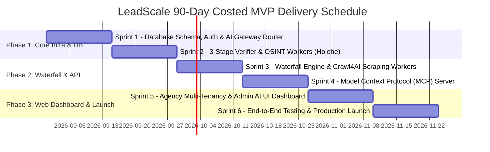

# 90-Day MVP Roadmap & Comprehensive Risk Register
## Project: LeadScale B2B Platform

---

## 1. Costed 90-Day Execution Roadmap

The 90-day MVP build is structured into **6 Sprints (2-week cycles)**.

### 1.1 Sprint-by-Sprint Breakdown

#### Sprint 1 (Days 1–14): Foundations, DB Schema & AI Gateway Router
* **Deliverables:** PostgreSQL schema execution (including `ai_providers` and `ai_usage_logs`), Supabase/Aurora setup, Redis BullMQ setup, Auth JWT/RBAC, and AI Gateway Service for routing across Groq, Gemini, OpenRouter, and DeepSeek.
* **Milestone:** Authentication, multi-tenant workspace setup, and AI Gateway Router live on staging.

#### Sprint 2 (Days 15–28): 3-Stage Verification & Open-Source OSINT Workers
* **Deliverables:** Async Python SMTP ping verifier, DNS MX validator, catch-all AI detector, and Dockerized Open-Source OSINT workers (`holehe`, `phoneinfoga`, `GHunt`).
* **Milestone:** Benchmark verifier pings 10,000 test emails with zero-cost Holehe social checks in <400ms.

#### Sprint 3 (Days 29–42): Waterfall Enrichment & Crawl4AI Web Scraper Fleet
* **Deliverables:** Integration with Prospeo, Findymail, Dropcontact, and Hunter APIs. Dockerized `unclecode/crawl4ai` scraper fleet for firmographic technology extraction.
* **Milestone:** End-to-end waterfall cascade resolves contact leads and saves to local PostgreSQL cache.

#### Sprint 4 (Days 43–56): Model Context Protocol (MCP) Server
* **Deliverables:** `@leadscale/mcp-server` implementation over STDIO and SSE. Implement tools: `search_leads`, `enrich_contact`, `verify_email_deliverability`, `check_credits`.
* **Milestone:** Claude Desktop & custom AI agents successfully execute lead generation tasks via MCP tool calls.

#### Sprint 5 (Days 57–70): Agency Multi-Tenancy & Admin AI Control UI
* **Deliverables:** Next.js 14 Web Portal, Parent-Child workspace manager, Admin UI for managing LLM APIs (add/track/remove providers), Stripe billing & invoice integration.
* **Milestone:** Agency owners manage client workspaces and Admins manage LLM router configurations.

#### Sprint 6 (Days 71–90): HubSpot Integration, Load Testing & Public Launch
* **Deliverables:** HubSpot 2-way sync connector, load testing to 5,000 req/sec, SOC2 compliance security audit, Cloudflare WAF hardening, public launch.
* **Milestone:** General Availability (GA) Release.

---

## 2. Resource Allocation & Development Budget

### 2.1 Team Composition (90 Days)
* **1x Lead Architect / Tech Lead** ($14,000 / mo)
* **2x Senior Backend / Go Engineers** ($22,000 / mo combined)
* **1x Full-Stack Next.js / Frontend Engineer** ($10,000 / mo)
* **1x DevOps & QA Engineer** ($9,000 / mo)
* **Total Monthly Personnel Cost:** **$55,000 / mo**

### 2.2 Total 90-Day MVP Budget

| Cost Category | Monthly Cost | 90-Day Total Cost |
| :--- | :--- | :--- |
| **Engineering Personnel (5 FTEs)** | $55,000 | $165,000 |
| **AWS & Cloudflare Infra Setup** | $1,200 | $3,600 |
| **Third-Party Partner API Credits (Testing)** | $800 | $2,400 |
| **Residential Proxy Network** | $500 | $1,500 |
| **Legal / Compliance / SOC2 Readiness** | $1,500 | $4,500 |
| **Contingency Reserve (10%)** | — | $17,700 |
| **Total Cost to Launch MVP** | **$59,000 / mo** | **$194,700** |

---

## 3. Comprehensive Risk Register & Mitigation Matrix

| Risk ID | Risk Category | Risk Event / Threat | Probability | Impact | Mitigation & Contingency Strategy |
| :--- | :--- | :--- | :--- | :--- | :--- |
| **RISK-01** | **Data Accuracy** | Target mail servers block live SMTP pings (Greylisting / Port 25 drops). | Medium | High | Implement AI catch-all scoring; rotate through 500+ residential proxy IPs; fallback gracefully to cached historical verified data. |
| **RISK-02** | **Deliverability** | Users experience high bounce rates on Catch-All emails, hurting domain trust. | Medium | Critical | Strictly enforce <1.8% Bounce SLA; auto-refund credits for any bounced email within 14 days; flag risky emails clearly in UI. |
| **RISK-03** | **Compliance** | EU GDPR or CCPA fine for unauthorized personal data collection. | Low | Critical | Real-time opt-out database sync; B2B Legitimate Interest Assessment (LIA) automated generation; automated erasure within 24 hours. |
| **RISK-04** | **Vendor Dependency** | Tier 1 Waterfall API partner raises prices or revokes API access. | Medium | Medium | Maintain multi-vendor redundancy (4 active API vendors); build custom web scraper fallbacks; grow local cache to reduce dependency. |
| **RISK-05** | **Anti-Bot / Scraping** | Public web sources update anti-bot protection (Cloudflare Turnstile, Kasada). | High | Medium | Use `unclecode/crawl4ai` and `Scrapling` Playwright stealth browsers with humanized mouse trajectories and AI-based captcha solvers. |
| **RISK-06** | **AI API Downtime / Limits** | Primary free AI provider (e.g. Groq) hits rate limits or experiences an outage. | Medium | Low | AI Gateway automatically fails over to Gemini Flash, OpenRouter Free, or Cerebras in <15ms without user interruption. |
