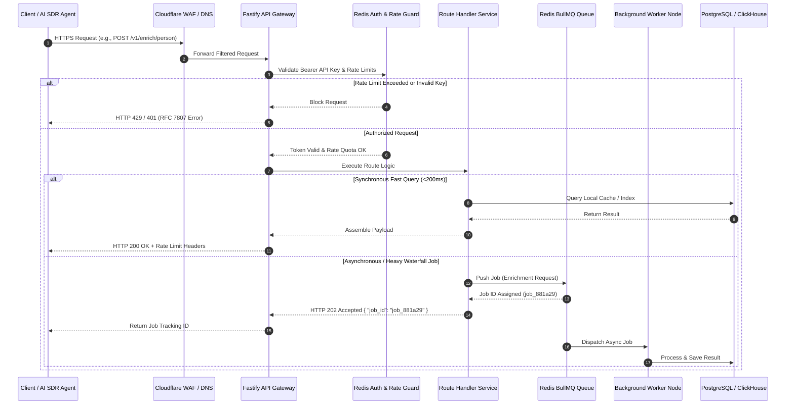
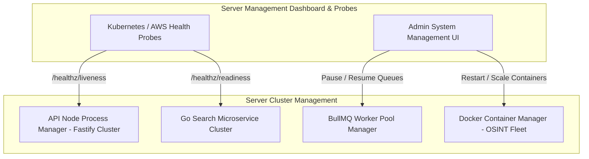

# Server Management, Request Lifecycle, Error Handling & Fallback Specifications
## Project: LeadScale B2B Platform

---

## 1. Overview & System Objectives

To guarantee **99.9% platform availability**, sub-200ms cached API responses, and resilient recovery during vendor outages or high load, LeadScale employs a standardized **Server Request Management, Global Error Handling, and Multi-Tier Fallback Architecture**.

This document details:
1. **Server Request Lifecycle:** How user and API requests are routed, validated, and processed.
2. **Server Management System:** Process clustering, worker pool monitoring, health probes, and administrative operations.
3. **Global Error Handling Standard:** Uniform RFC 7807 error responses and error classification.
4. **Multi-Tier Fallback Systems & Circuit Breakers:** Fallback cascades for Waterfall Enrichment, LLM APIs, and Verification pings.
5. **Queue Reliability & Recovery:** Retry policies, Dead-Letter Queues (DLQ), and database failover.

---

## 2. Server Request Lifecycle & Processing Model



### 2.1 Request Input Validation & Runtime Guard
Every incoming request payload is strictly validated at the API Gateway using **TypeBox / Zod JSON Schemas**.
* Requests failing schema validation are rejected instantly at the Gateway level (`HTTP 400 Bad Request`) without reaching downstream backend workers or database connections.
* Strict sanitization strips malicious script tags and SQL injection vectors prior to route execution.

---

## 3. Server Management System Architecture

### 3.1 Process Management & Worker Topology

LeadScale operates a decoupled server process architecture:
1. **API Gateway Nodes (Fastify / Node.js Cluster):** Runs PM2 / Node.js cluster mode spawning 1 worker process per vCPU core. Handles stateless HTTP requests, JWT/API key validation, and rate limiting.
2. **Search API Nodes (Go / Golang):** High-throughput compiled binary handling contact search filters and pgvector/Meilisearch vector queries.
3. **Async Worker Nodes (Python Asyncio / Celery / BullMQ):** Background workers dedicated to Live SMTP handshakes, proxy rotation, and third-party API calls.
4. **Containerized OSINT Microservices (Docker):** Isolated containers running `crawl4ai`, `holehe`, and `phoneinfoga`.



### 3.2 Server Health & Readiness Probes

The API Gateway exposes three dedicated health monitoring endpoints for load balancers and Kubernetes orchestrators:

* `GET /healthz/liveness`  
  **Purpose:** Basic process liveness check. Returns `HTTP 200 OK` if the web process is running.
* `GET /healthz/readiness`  
  **Purpose:** Validates that downstream dependencies (PostgreSQL primary, Redis cluster, ClickHouse) are connected and accepting queries. If PostgreSQL connection drops, returns `HTTP 503 Service Unavailable` to pull node out of load balancer rotation.
* `GET /admin/system/metrics` (Admin Auth Required)  
  **Purpose:** Returns real-time server metrics: CPU/RAM usage per process, active WebSocket/SSE connections, Redis queue depth, and database connection pool utilization.

---

## 4. Global Error Handling Standard (RFC 7807)

LeadScale implements the **RFC 7807 Problem Details** standard for all error responses across REST APIs, Webhooks, and MCP agent responses.

### 4.1 Standard JSON Error Response Format

```json
{
  "type": "https://api.leadscale.io/errors/ERR_WATERFALL_TIMEOUT",
  "title": "Waterfall Enrichment Provider Timeout",
  "status": 504,
  "code": "ERR_WATERFALL_TIMEOUT",
  "detail": "Primary enrichment providers (Prospeo, Findymail) failed to respond within the 2500ms SLA window.",
  "instance": "/v1/enrich/person",
  "timestamp": "2026-08-12T14:30:15Z",
  "request_id": "req_9921b71a",
  "meta": {
    "providers_attempted": ["prospeo", "findymail"],
    "action_taken": "job_pushed_to_async_queue",
    "credit_deducted": false
  }
}
```

### 4.2 Application Error Code Matrix

| Error Code | HTTP Status | Root Cause | User / System Recovery Action |
| :--- | :--- | :--- | :--- |
| `ERR_UNAUTHORIZED` | 401 | Invalid or missing API key in `Authorization` header. | Verify key formatting and workspace activation status. |
| `ERR_RATE_LIMIT_EXCEEDED` | 429 | Request frequency exceeded sliding window Redis limit. | Inspect `Retry-After` header and implement exponential backoff. |
| `ERR_CREDIT_BALANCE_DEPLETED` | 402 | Workspace credit balance reached 0. | Auto-refill or upgrade subscription tier in Billing portal. |
| `ERR_VALIDATION_FAILED` | 400 | Payload failed schema parameters (missing mandatory domain/title). | Fix request JSON structure matching OpenAPI spec. |
| `ERR_WATERFALL_TIMEOUT` | 504 | External enrichment vendors timed out (>2.5s). | Circuit breaker triggers fallback; request moves to async queue. |
| `ERR_LLM_PROVIDER_DOWN` | 502 | Target AI API (e.g. Groq) returned 5xx server error. | AI Gateway automatically reroutes request to secondary free AI provider. |
| `ERR_SMTP_PING_BLOCKED` | 503 | Target mail server greylisted connection attempt. | Verifier escalates to Stage 3 AI catch-all pattern scorer. |

---

## 5. Multi-Tier Fallback Systems & Circuit Breakers

LeadScale enforces resilience across **three critical execution pathways**:

```mermaid
graph TD
    subgraph Pathway 1: Waterfall Data Enrichment Fallback
        W1[Local Cache Check] -- Miss --> W2[Tier 1: Prospeo API]
        W2 -- Timeout / Fail --> W3[Tier 2: Findymail API]
        W3 -- Timeout / Fail --> W4[Tier 3: Dropcontact API]
        W4 -- Fail --> W5[Return 'Unenriched' & Charge 0 Credits]
    end

    subgraph Pathway 2: Multi-LLM AI Gateway Fallback
        L1[Groq Llama 3.3 - 300 t/s] -- HTTP 429 / 5xx --> L2[Google Gemini 2.5 Flash]
        L2 -- HTTP 429 / 5xx --> L3[OpenRouter Free Tier]
        L3 -- HTTP 429 / 5xx --> L4[Cerebras / DeepSeek]
        L4 -- Fail --> L5[Paid OpenAI Fallback]
    end

    subgraph Pathway 3: Real-Time Email Verification Fallback
        V1[Direct SMTP Handshake] -- Greylisted / Blocked --> V2[OSINT Social Presence Check - Holehe/GHunt]
        V2 -- Inconclusive --> V3[AI Catch-All Pattern Scorer]
        V3 -- Low Confidence --> V4[Flag 'Status: Risky' & Refund Credit]
    end
```



### 5.1 Circuit Breaker Implementation Specifications

All external third-party API integration clients (Vendor APIs and LLM APIs) are wrapped in a **Circuit Breaker** (using Hystrix-style state machines):

* **CLOSED State (Normal Operation):** All requests route to the primary provider.
* **Failure Threshold:** If a provider returns `5xx` errors or timeouts (>2,500ms) on **>15% of requests over a rolling 30-second window**, circuit transitions to **OPEN**.
* **OPEN State (Fast Failover):** Traffic bypasses the failing provider instantly for **60 seconds**, routing 100% of volume to the secondary fallback provider.
* **HALF-OPEN State (Testing Recovery):** After 60 seconds, 5% of requests are trial-routed to the primary provider. If successful, circuit resets to **CLOSED**; if failed, resets to **OPEN** for 120 seconds.

---

## 6. Queue Reliability, Retries & Failover Strategy

### 6.1 Async BullMQ Retry Policy
All background processing jobs (batch verification, enrichment webhooks, CRM sync) implement **Exponential Backoff with Random Jitter**:

```javascript
// BullMQ Job Retry Configuration
const defaultJobOptions = {
  attempts: 5,
  backoff: {
    type: 'exponential',
    delay: 2000, // Initial retry delay: 2s, 4s, 8s, 16s, 32s
  },
  removeOnComplete: { age: 86400 }, // Keep completed jobs in log for 24h
  removeOnFail: false, // Retain failed jobs for Dead-Letter Queue inspection
};
```

### 6.2 Dead-Letter Queue (DLQ) & Admin Re-Drive
* Jobs failing all 5 retry attempts are automatically moved to the **Dead-Letter Queue (`dlq_enrichment_jobs`)**.
* Admins can view DLQ failure causes from the Admin Dashboard and execute **1-Click Bulk Re-Drive** once vendor issues resolve.

### 6.3 Database High Availability & Failover
* **PostgreSQL Aurora:** Multi-AZ setup with automatic storage auto-scaling and sub-30 second multi-AZ instance failover.
* **Redis Cluster:** 3-master, 3-replica cluster with automatic sentinel failover to ensure zero downtime for rate limiting and queue management.
