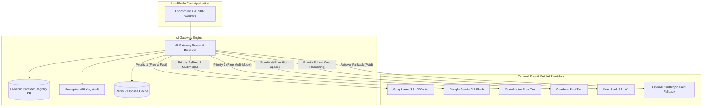

# Free AI APIs Catalog & Multi-LLM Router Architecture
## Project: LeadScale B2B Platform

---

## 1. Overview & Strategic Purpose

To maximize platform profitability and ensure 100% uptime for AI-driven lead generation tasks (such as company research, email pattern generation, catch-all confidence scoring, and cold email drafting), LeadScale incorporates a **Multi-LLM Gateway & Router Architecture**.

This architecture leverages a comprehensive registry of **Free & Open AI APIs**, automatically routing non-critical tasks to zero-cost inference endpoints before falling back to paid providers.

---

## 2. Comprehensive 2026 Directory of Free AI & LLM APIs

| Provider | Top Free Models | Free Quota / Limits | Best Use Case in LeadScale | API Standard / Compatibility |
| :--- | :--- | :--- | :--- | :--- |
| **Google AI Studio** | Gemini 2.5 Flash, Gemini 2.5 Pro | 5–15 RPM, 250K TPM, 1M context | Cold email draft generation, multimodal image/PDF lead parsing | REST / OpenAI Compatible via Wrapper |
| **Groq API** | Llama 3.3 70B, Mixtral 8x7B, Whisper v3 | 30 RPM, 1,000 req/day (300+ tok/s) | Real-time JSON extraction, catch-all email pattern classification | Native OpenAI Compatible (`/v1/chat/completions`) |
| **OpenRouter Free** | ~35 free models (DeepSeek R1, Llama 3.3, Qwen 2.5) | 20 RPM, 50 req/day (1k req/day with $10 deposit) | Dynamic fallback testing & model benchmarking | Native OpenAI Compatible |
| **Cerebras Cloud** | Llama 3.3 70B, Qwen 2.5 32B | 30 RPM, 1 Million tokens/day | High-speed batch contact categorization & enrichment | Native OpenAI Compatible |
| **Cloudflare Workers AI** | Llama 3.2, Mistral 7B, Whisper | 10,000 free neurons/day | Edge worker micro-processing & fast sentiment scoring | REST API / Cloudflare SDK |
| **GitHub Models** | GPT-4o, Claude 3.5 Sonnet, Llama 3.3, Phi-4 | 15 RPM, 150–1,000 req/day | High-quality sales brief generation during user testing | Native OpenAI Compatible |
| **Mistral AI (La Plateforme)**| Codestral, Mistral Small / Large | ~1 Billion tokens/month | Structured schema generation, European language support | Native OpenAI Compatible |
| **Cohere API** | Command R+, Embed v3, Rerank v3 | 20 RPM, 1,000 req/month | Vector search reranking & semantic lead matching | Cohere SDK / REST |
| **DeepSeek API** | DeepSeek V3, DeepSeek R1 | 5M free tokens granted on signup | Complex reasoning over company job postings & intent | Native OpenAI Compatible |
| **NVIDIA NIM** | Nemotron 70B, Llama 3.3, Kimi | 40 RPM, 1,000 evaluation credits | High-accuracy entity recognition from unformatted web text | Native OpenAI Compatible |
| **SambaNova Cloud** | Llama 3.1 405B, Llama 3.3 70B | $5 free credit / fast trial tier | Reasoning over complex corporate hierarchy structures | Native OpenAI Compatible |
| **Jina AI Reader / Search** | Jina Reader (`r.jina.ai`) | Unlimited free web-to-markdown | Converting target company websites to clean LLM markdown | Simple HTTP GET (`https://r.jina.ai/URL`) |
| **Exa.ai / Tavily Search** | Neural Search APIs | 1,000 free search calls/month | Searching real-time company news, funding, and job changes | REST API |

---

## 3. Multi-LLM Router & Gateway Architecture ("AI Gateway Service")

The LeadScale AI Gateway is a lightweight, high-performance Node.js/Go microservice that sits between our application workers and external AI API providers.



---

## 4. Key AI Gateway Capabilities

### 4.1 Admin Dynamic Management Dashboard
* **Zero-Downtime Provider Control:** Admins can add new AI API providers, update API keys, toggle provider status (Enabled/Disabled), or adjust priority weights live from the Admin Web UI without redeploying code.
* **Granular Task Routing Rules:**
  * `Task: Web Extraction Parsing` → Route to **Groq** (Fastest) → Fallback to **Gemini Flash**.
  * `Task: Cold Outreach Email Copy` → Route to **GitHub Models (GPT-4o)** → Fallback to **DeepSeek V3**.
  * `Task: Company Intent Reasoning` → Route to **DeepSeek R1** → Fallback to **Gemini 2.5 Pro**.
* **Automatic Rate Limit & Fallback Circuit Breaker:**
  * Tracks Requests Per Minute (RPM) and Tokens Per Minute (TPM) in Redis.
  * If Provider A returns HTTP 429 (Rate Limit Exceeded) or times out (>2.5s), the gateway instantly reroutes the request to Provider B in <15ms.

### 4.2 Token Budget & Cost Tracking
* Real-time metrics dashboard tracking total tokens consumed, request latency (p50/p95), cost saved ($) via free tier routing vs. paid OpenAI, and provider error rates.

---

## 5. Admin Database Schema Extension for LLM Management

```sql
-- Dynamic AI Provider Registry Table
CREATE TABLE ai_providers (
    id UUID PRIMARY KEY DEFAULT uuid_generate_v4(),
    name VARCHAR(100) UNIQUE NOT NULL, -- e.g., 'groq', 'gemini_flash', 'openrouter_free'
    base_url TEXT NOT NULL,
    api_key_encrypted TEXT NOT NULL,
    is_active BOOLEAN NOT NULL DEFAULT TRUE,
    priority_order INTEGER NOT NULL DEFAULT 10,
    cost_per_1k_input_tokens NUMERIC(8,6) DEFAULT 0.000000,
    cost_per_1k_output_tokens NUMERIC(8,6) DEFAULT 0.000000,
    rate_limit_rpm INTEGER DEFAULT 30,
    rate_limit_tpm INTEGER DEFAULT 100000,
    created_at TIMESTAMPTZ NOT NULL DEFAULT NOW(),
    updated_at TIMESTAMPTZ NOT NULL DEFAULT NOW()
);

-- AI Usage & Audit Log Table
CREATE TABLE ai_usage_logs (
    id UUID PRIMARY KEY DEFAULT uuid_generate_v4(),
    provider_id UUID REFERENCES ai_providers(id) ON DELETE SET NULL,
    task_type VARCHAR(100) NOT NULL, -- 'email_verification_ai', 'outreach_draft', 'schema_extraction'
    prompt_tokens INTEGER NOT NULL,
    completion_tokens INTEGER NOT NULL,
    latency_ms INTEGER NOT NULL,
    is_success BOOLEAN NOT NULL DEFAULT TRUE,
    error_message TEXT,
    created_at TIMESTAMPTZ NOT NULL DEFAULT NOW()
);
```
