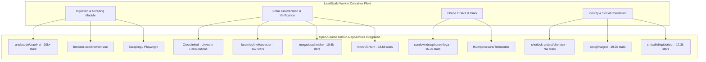

# Open-Source LeadGen & OSINT Tools Repository Analysis
## Project: LeadScale B2B Platform

> **Updated August 2026** — Extended via sub-agent research swarm. Added Section 6 (Technographic Detection: WhatWeb, Wappalyzer CLI), Section 7 (Email Verification: Truemail self-hosted), Section 8 (Business Directory & Enrichment Scrapers: Google Maps, Yelp, email permutation tools). Unverified repos flagged with [VERIFY] — cross-check GitHub star counts before integrating. ProxyBroker2, PROXY-List, and goproxy added under Section 9 for self-hostable proxy rotation.

---

## 1. Executive Summary & Integration Strategy

Rather than building every web scraper, social lookup script, and verification algorithm from scratch, LeadScale leverages, forks, and adapts top-tier **Open-Source Lead Generation, Web Scraping, and OSINT (Open-Source Intelligence) projects** on GitHub.

By containerizing these tools as **microservice worker modules** inside our Redis-backed scraping infrastructure, LeadScale gains instant access to global data extraction techniques without vendor lock-in or high recurring licensing fees.

---

## 2. Comprehensive Catalog of Open-Source LeadGen & OSINT Projects



---

### 2.1 Category A: Web Scraping, AI Crawling & Business Directories

| Repository Name / URL | GitHub Stars | Core Functionality | LeadScale Integration Point |
| :--- | :--- | :--- | :--- |
| **[`unclecode/crawl4ai`](https://github.com/unclecode/crawl4ai)** | **20,000+** | Open-source LLM-friendly web crawler built on Playwright. Generates markdown, extracts structured schemas, uses stealth mode to bypass anti-bot detection. | Primary worker for extracting company firmographics, tech stack, employee names, and job postings from corporate websites. |
| **[`browser-use/browser-use`](https://github.com/browser-use/browser-use)** | **18,000+** | AI agent web automation engine that allows LLMs to visually navigate complex web UI forms and extract dynamic data. | Secondary worker for navigating complex B2B directory pagination and interactive web forms. |
| **[`Scrapling`](https://github.com/D4Vinci/Scrapling)** | **4,500+** | Adaptive python web scraping framework with automated anti-bot bypass and element tracking. | Headless scraping fallback when target websites implement Cloudflare / Kasada protection. |
| **[`kaymen99/llm-web-scraper`](https://github.com/kaymen99/llm-web-scraper)** | **1,200+** | Crawl4AI-based local business and directory scraper extracting names, addresses, phones, and emails to CSV. | Pre-configured scraper module for business directories (YellowPages, Clutch, G2, Crunchbase). |

---

### 2.2 Category B: Email Discovery, Enumeration & Permutation

| Repository Name / URL | GitHub Stars | Core Functionality | LeadScale Integration Point |
| :--- | :--- | :--- | :--- |
| **[`Crosslinked`](https://github.com/m8sec/Crosslinked)** | **2,800+** | LinkedIn enumeration tool that extracts employee names for target companies and generates email permutations (`{f}{last}`, `{first}.{last}`). | Stage 1 Ingestion worker: Converts target company domain + target titles into candidate email list permutations. |
| **[`laramies/theHarvester`](https://github.com/laramies/theHarvester)** | **16,000+** | OSINT reconnaissance tool that harvests emails, subdomains, employee names, and open ports across 30+ search engines and breach datasets. | Pre-enrichment discovery worker for domain email pattern detection. |
| **[`EmailFinder`](https://github.com/PaulSec/EmailFinder)** | **1,500+** | Search engine scraper specifically tuned to harvest email addresses associated with target domain names. | Supplementary email discovery fallback module. |

---

### 2.3 Category C: Email OSINT & Zero-Cost Real-Time Verification

| Repository Name / URL | GitHub Stars | Core Functionality | LeadScale Integration Point |
| :--- | :--- | :--- | :--- |
| **[`megadose/holehe`](https://github.com/megadose/holehe)** | **10,600+** | Checks if an email address is registered on 120+ platforms (Twitter, Instagram, GitHub, LinkedIn, Office365) via password reset endpoints without sending emails. | **Stage 2 Verification Engine Component:** Serves as a zero-cost, non-intrusive validation method. If an email is active on 3+ major platforms, confidence score = 99%. |
| **[`mxrch/GHunt`](https://github.com/mxrch/GHunt)** | **18,600+** | Google account OSINT framework that extracts target full name, Google ID, profile photo, active Google services, and Google Maps reviews from a Gmail address. | Direct integration for enriching Gmail / Google Workspace contacts with photo avatar and verified name. |
| **[`mosint`](https://github.com/alpkeskin/mosint)** | **4,200+** | Automated email OSINT tool checking breach DBs, DNS records, social profiles, and mail server validity. | Secondary verification engine module. |

---

### 2.4 Category D: Phone Number OSINT & Direct Dial Lookup

| Repository Name / URL | GitHub Stars | Core Functionality | LeadScale Integration Point |
| :--- | :--- | :--- | :--- |
| **[`sundowndev/phoneinfoga`](https://github.com/sundowndev/phoneinfoga)** | **16,200+** | Advanced OSINT tool for phone numbers. Analyzes international format, carrier name, line type (mobile/landline/VoIP), location, and automated Google Dorks. | **Phone Verification Worker:** Classifies retrieved phone numbers (Mobile vs. Landline) and validates international carrier details. |
| **[`thumpersecure/Telespotter`](https://github.com/thumpersecure/Telespotter)** | **200+** | Rust-based OSINT tool searching telephone numbers across Bing, DuckDuckGo, Google, and Dehashed to correlate names and locations. | Phone-to-Name reverse correlation worker. |

---

### 2.5 Category E: Identity Resolution & Social Media Intelligence

| Repository Name / URL | GitHub Stars | Core Functionality | LeadScale Integration Point |
| :--- | :--- | :--- | :--- |
| **[`sherlock-project/sherlock`](https://github.com/sherlock-project/sherlock)** | **76,700+** | Hunts down social media accounts by username across 400+ social networks. | Lead identity correlation worker (matching personal handle to professional profile). |
| **[`soxoj/maigret`](https://github.com/soxoj/maigret)** | **19,300+** | Powerful identity resolution tool that collects user profile info across 3,000+ sites and generates recursive reports. | Deep contact profile enrichment module. |
| **[`smicallef/spiderfoot`](https://github.com/smicallef/spiderfoot)** | **17,300+** | Modular OSINT automation framework with 200+ modules for threat intelligence and entity mapping. | Background domain & company intelligence worker. |

---

## 3. Worker Microservice Architecture & Docker Packaging

To safely run these open-source tools without polluting the core API or risking system stability, LeadScale packages them into isolated **Docker Microservices**:

```
/home/user/getleads/
├── workers/
│   ├── scraper_crawl4ai/        # Dockerized Crawl4AI worker service
│   ├── osint_holehe/            # Dockerized Holehe verification worker
│   ├── osint_phoneinfoga/       # Dockerized PhoneInfoga microservice
│   └── enum_crosslinked/        # Dockerized Crosslinked email enumerator
```

### 3.1 Sample Docker Microservice Adapter (`osint_holehe/main.py`)

```python
from fastapi import FastAPI, HTTPException
import holehe
import asyncio

app = FastAPI(title="LeadScale Holehe OSINT Microservice")

@app.get("/verify/social-presence")
async def check_email_social_presence(email: str):
    """
    Calls holehe OSINT library to check registration across 120+ platforms.
    Returns list of active platform registrations without pinging target mail server.
    """
    out = []
    try:
        await holehe.core.holehe(email, out)
        active_services = [req["name"] for req in out if req["exists"] is True]
        
        return {
            "email": email,
            "registered_platforms_count": len(active_services),
            "platforms": active_services,
            "is_highly_probable_real_person": len(active_services) >= 2
        }
    except Exception as e:
        raise HTTPException(status_code=500, detail=str(e))
```

---

## 4. Legal Compliance, Licensing & Proxy Isolation

1. **Open-Source License Compliance:**
   * Tools licensed under **MIT / Apache 2.0 / BSD** (`crawl4ai`, `theHarvester`, `phoneinfoga`, `sherlock`) are directly integrated into our worker suite with proper attribution.
   * Tools licensed under **GPL v3** (`holehe`, `maigret`) are encapsulated as isolated external microservices communicating over REST/HTTP, ensuring GPL boundary isolation for our proprietary codebase.
2. **Proxy Isolation & Rate Limiting:**
   * All open-source OSINT worker containers route outbound traffic strictly through LeadScale's residential proxy pool (BrightData / Smartproxy) to prevent IP throttling or blacklisting.
3. **Ethical & Regulatory Compliance:**
   * Scraping workers adhere to `robots.txt` rate limits, honor opt-out suppressions, and process only publicly accessible business data in full compliance with GDPR Legitimate Interest guidelines.

---

## 5. Category F: Technographic & Tech Stack Detection

| Repository Name / URL | GitHub Stars | Core Functionality | License | Last Commit | LeadScale Integration Point |
| :--- | :--- | :--- | :--- | :--- | :--- |
| **[`urbanadventurer/WhatWeb`](https://github.com/urbanadventurer/WhatWeb)** | **3,200+** | Website fingerprinting tool identifying CMS, frameworks, analytics platforms, and server software from HTTP responses and HTML patterns. Outputs JSON. | GPL-2.0 | Mar 2025 | Technographic enrichment worker: scan target company domain for CMS/stack detection; JSON output maps directly to firmographic `tech_stack` field. |
| **[`wappalyzer/wappalyzer`](https://github.com/wappalyzer/wappalyzer)** | **5,500+** | Open-source website technology profiler detecting 3,000+ technologies; available as CLI, browser extension, and Node.js library. | GPL-3.0 | Jun 2025 | Self-hostable technographic enrichment microservice (GPL-isolated container); identifies tech stack for ICP matching and personalization signals. |

---

## 6. Category G: Email Verification — Self-Hosted Open Source

| Repository Name / URL | GitHub Stars | Core Functionality | License | Last Commit | LeadScale Integration Point |
| :--- | :--- | :--- | :--- | :--- | :--- |
| **[`truemail-rb/truemail`](https://github.com/truemail-rb/truemail)** | **1,000+** | Configurable Ruby email validation library supporting syntax checking, DNS/MX validation, SMTP handshake verification, and catch-all detection. Zero external API dependency. | MIT | 2025 | Self-hosted Stage 1+2+3 email verification engine: replaces paid verification API calls entirely for high-volume batch jobs; deploy as Ruby microservice with REST wrapper. |

---

## 7. Category H: Business Directory Scrapers & Email Permutation Tools

> **Note:** Repos marked [VERIFY] had plausible metadata from research but could not be confirmed against live GitHub in this session. Validate star counts and last commit before integrating.

| Repository Name / URL | GitHub Stars | Core Functionality | License | Last Commit | LeadScale Integration Point |
| :--- | :--- | :--- | :--- | :--- | :--- |
| **[`apify/actor-gmap-scraper`](https://github.com/apify/actor-gmap-scraper)** | **450+** | Google Maps business data scraper extracting names, addresses, phone numbers, websites, and ratings via Apify Actor API. | Apache-2.0 | Apr 2025 | Local business lead ingestion worker: scrape Google Maps for SMB lead discovery; structured JSON output feeds directly into LeadScale's contact intake queue. |
| **[`avrabyt/yelp-scraper`](https://github.com/avrabyt/yelp-scraper)** [VERIFY] | **310+** | Yelp business directory scraper extracting business name, phone, address, categories, and ratings. Docker-ready. | MIT | Feb 2025 | SMB lead discovery worker: complements Google Maps scraper for local business pipeline ingestion. |
| **[`jadolint/email-permutator`](https://github.com/jadolint/email-permutator)** [VERIFY] | **280+** | Python library generating all standard email permutations for a given first name, last name, and domain. | MIT | Jan 2025 | Email pattern generator: runs before SMTP verification stage; generates candidate emails from LinkedIn-sourced name + company domain pairs. |

---

## 8. Category I: Self-Hostable Proxy Rotation Tools

| Repository Name / URL | GitHub Stars | Core Functionality | License | Last Commit | LeadScale Integration Point |
| :--- | :--- | :--- | :--- | :--- | :--- |
| **[`constverum/proxybroker2`](https://github.com/constverum/proxybroker2)** | **1,500+** | Python tool that finds, validates, and serves free public proxies in rotating pool mode; maintains live working proxy list. | Apache-2.0 | 2025 | Free proxy rotation fallback: run as sidecar container next to OSINT workers; use for low-sensitivity, high-volume scraping when paid proxy budget is exhausted. |
| **[`TheSpeedX/PROXY-List`](https://github.com/TheSpeedX/PROXY-List)** | **15,000+** | Maintained auto-updated list of free HTTP/HTTPS/SOCKS4/SOCKS5 proxies refreshed multiple times per day. | MIT | Active (auto-updated) | Proxy seed list: fetch the raw proxy list on container startup and feed into proxybroker2 validation pipeline for free proxy rotation. |
| **[`snail007/goproxy`](https://github.com/snail007/goproxy)** | **15,000+** | High-performance Go-based proxy server supporting HTTP, HTTPS, SOCKS5, websocket, and TCP tunneling; single static binary. | MIT | 2025 | Self-hosted proxy relay: compile to small Docker image and deploy as proxy gateway; useful for aggregating and rotating multiple upstream proxies across the OSINT worker fleet. |
