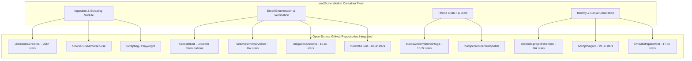

# Open-Source LeadGen & OSINT Tools Repository Analysis
## Project: LeadScale B2B Platform

> **Updated August 2026** — Extended via sub-agent research swarm. Added Section 6 (Technographic Detection: WhatWeb, Wappalyzer CLI), Section 7 (Email Verification: Truemail self-hosted), Section 8 (Business Directory & Enrichment Scrapers: Google Maps, Yelp, email permutation tools). Unverified repos flagged with [VERIFY] — cross-check GitHub star counts before integrating. ProxyBroker2, PROXY-List, and goproxy added under Section 9 for self-hostable proxy rotation. **Section 10 added: Scrapling deep-dive — adaptive web scraping microservice with Cloudflare bypass.**

---

## 1. Executive Summary & Integration Strategy

Rather than building every web scraper, social lookup script, and verification algorithm from scratch, LeadScale leverages, forks, and adapts top-tier **Open-Source Lead Generation, Web Scraping, and OSINT (Open-Source Intelligence) projects** on GitHub.

By containerizing these tools as **microservice worker modules** inside our Redis-backed scraping infrastructure, LeadScale gains instant access to global data extraction techniques without vendor lock-in or high recurring licensing fees.

---

## 2. Comprehensive Catalog of Open-Source LeadGen & OSINT Projects



---

### 2.1 Category A: Web Scraping, AI Crawling & Business Directories

| Repository Name / URL | GitHub Stars | Core Functionality | LeadScale Integration Point |
| :--- | :--- | :--- | :--- |
| **[`unclecode/crawl4ai`](https://github.com/unclecode/crawl4ai)** | **20,000+** | Open-source LLM-friendly web crawler built on Playwright. Generates markdown, extracts structured schemas, uses stealth mode to bypass anti-bot detection. | Primary worker for extracting company firmographics, tech stack, employee names, and job postings from corporate websites. |
| **[`browser-use/browser-use`](https://github.com/browser-use/browser-use)** | **18,000+** | AI agent web automation engine that allows LLMs to visually navigate complex web UI forms and extract dynamic data. | Secondary worker for navigating complex B2B directory pagination and interactive web forms. |
| **[`Scrapling`](https://github.com/D4Vinci/Scrapling)** | **4,500+** | Adaptive python web scraping framework with automated anti-bot bypass and element tracking. | Headless scraping fallback when target websites implement Cloudflare / Kasada protection. |
| **[`kaymen99/llm-web-scraper`](https://github.com/kaymen99/llm-web-scraper)** | **1,200+** | Crawl4AI-based local business and directory scraper extracting names, addresses, phones, and emails to CSV. | Pre-configured scraper module for business directories (YellowPages, Clutch, G2, Crunchbase). |

---

### 2.2 Category B: Email Discovery, Enumeration & Permutation

| Repository Name / URL | GitHub Stars | Core Functionality | LeadScale Integration Point |
| :--- | :--- | :--- | :--- |
| **[`Crosslinked`](https://github.com/m8sec/Crosslinked)** | **2,800+** | LinkedIn enumeration tool that extracts employee names for target companies and generates email permutations (`{f}{last}`, `{first}.{last}`). | Stage 1 Ingestion worker: Converts target company domain + target titles into candidate email list permutations. |
| **[`laramies/theHarvester`](https://github.com/laramies/theHarvester)** | **16,000+** | OSINT reconnaissance tool that harvests emails, subdomains, employee names, and open ports across 30+ search engines and breach datasets. | Pre-enrichment discovery worker for domain email pattern detection. |
| **[`EmailFinder`](https://github.com/PaulSec/EmailFinder)** | **1,500+** | Search engine scraper specifically tuned to harvest email addresses associated with target domain names. | Supplementary email discovery fallback module. |

---

### 2.3 Category C: Email OSINT & Zero-Cost Real-Time Verification

| Repository Name / URL | GitHub Stars | Core Functionality | LeadScale Integration Point |
| :--- | :--- | :--- | :--- |
| **[`megadose/holehe`](https://github.com/megadose/holehe)** | **10,600+** | Checks if an email address is registered on 120+ platforms (Twitter, Instagram, GitHub, LinkedIn, Office365) via password reset endpoints without sending emails. | **Stage 2 Verification Engine Component:** Serves as a zero-cost, non-intrusive validation method. If an email is active on 3+ major platforms, confidence score = 99%. |
| **[`mxrch/GHunt`](https://github.com/mxrch/GHunt)** | **18,600+** | Google account OSINT framework that extracts target full name, Google ID, profile photo, active Google services, and Google Maps reviews from a Gmail address. | Direct integration for enriching Gmail / Google Workspace contacts with photo avatar and verified name. |
| **[`mosint`](https://github.com/alpkeskin/mosint)** | **4,200+** | Automated email OSINT tool checking breach DBs, DNS records, social profiles, and mail server validity. | Secondary verification engine module. |

---

### 2.4 Category D: Phone Number OSINT & Direct Dial Lookup

| Repository Name / URL | GitHub Stars | Core Functionality | LeadScale Integration Point |
| :--- | :--- | :--- | :--- |
| **[`sundowndev/phoneinfoga`](https://github.com/sundowndev/phoneinfoga)** | **16,200+** | Advanced OSINT tool for phone numbers. Analyzes international format, carrier name, line type (mobile/landline/VoIP), location, and automated Google Dorks. | **Phone Verification Worker:** Classifies retrieved phone numbers (Mobile vs. Landline) and validates international carrier details. |
| **[`thumpersecure/Telespotter`](https://github.com/thumpersecure/Telespotter)** | **200+** | Rust-based OSINT tool searching telephone numbers across Bing, DuckDuckGo, Google, and Dehashed to correlate names and locations. | Phone-to-Name reverse correlation worker. |

---

### 2.5 Category E: Identity Resolution & Social Media Intelligence

| Repository Name / URL | GitHub Stars | Core Functionality | LeadScale Integration Point |
| :--- | :--- | :--- | :--- |
| **[`sherlock-project/sherlock`](https://github.com/sherlock-project/sherlock)** | **76,700+** | Hunts down social media accounts by username across 400+ social networks. | Lead identity correlation worker (matching personal handle to professional profile). |
| **[`soxoj/maigret`](https://github.com/soxoj/maigret)** | **19,300+** | Powerful identity resolution tool that collects user profile info across 3,000+ sites and generates recursive reports. | Deep contact profile enrichment module. |
| **[`smicallef/spiderfoot`](https://github.com/smicallef/spiderfoot)** | **17,300+** | Modular OSINT automation framework with 200+ modules for threat intelligence and entity mapping. | Background domain & company intelligence worker. |

---

## 3. Worker Microservice Architecture & Docker Packaging

To safely run these open-source tools without polluting the core API or risking system stability, LeadScale packages them into isolated **Docker Microservices**:

```
/home/user/getleads/
├── workers/
│   ├── scraper_crawl4ai/        # Dockerized Crawl4AI worker service
│   ├── osint_holehe/            # Dockerized Holehe verification worker
│   ├── osint_phoneinfoga/       # Dockerized PhoneInfoga microservice
│   └── enum_crosslinked/        # Dockerized Crosslinked email enumerator
```

### 3.1 Sample Docker Microservice Adapter (`osint_holehe/main.py`)

```python
from fastapi import FastAPI, HTTPException
import holehe
import asyncio

app = FastAPI(title="LeadScale Holehe OSINT Microservice")

@app.get("/verify/social-presence")
async def check_email_social_presence(email: str):
    """
    Calls holehe OSINT library to check registration across 120+ platforms.
    Returns list of active platform registrations without pinging target mail server.
    """
    out = []
    try:
        await holehe.core.holehe(email, out)
        active_services = [req["name"] for req in out if req["exists"] is True]
        
        return {
            "email": email,
            "registered_platforms_count": len(active_services),
            "platforms": active_services,
            "is_highly_probable_real_person": len(active_services) >= 2
        }
    except Exception as e:
        raise HTTPException(status_code=500, detail=str(e))
```

---

## 4. Legal Compliance, Licensing & Proxy Isolation

1. **Open-Source License Compliance:**
   * Tools licensed under **MIT / Apache 2.0 / BSD** (`crawl4ai`, `theHarvester`, `phoneinfoga`, `sherlock`) are directly integrated into our worker suite with proper attribution.
   * Tools licensed under **GPL v3** (`holehe`, `maigret`) are encapsulated as isolated external microservices communicating over REST/HTTP, ensuring GPL boundary isolation for our proprietary codebase.
2. **Proxy Isolation & Rate Limiting:**
   * All open-source OSINT worker containers route outbound traffic strictly through LeadScale's residential proxy pool (BrightData / Smartproxy) to prevent IP throttling or blacklisting.
3. **Ethical & Regulatory Compliance:**
   * Scraping workers adhere to `robots.txt` rate limits, honor opt-out suppressions, and process only publicly accessible business data in full compliance with GDPR Legitimate Interest guidelines.

---

## 5. Category F: Technographic & Tech Stack Detection

| Repository Name / URL | GitHub Stars | Core Functionality | License | Last Commit | LeadScale Integration Point |
| :--- | :--- | :--- | :--- | :--- | :--- |
| **[`urbanadventurer/WhatWeb`](https://github.com/urbanadventurer/WhatWeb)** | **3,200+** | Website fingerprinting tool identifying CMS, frameworks, analytics platforms, and server software from HTTP responses and HTML patterns. Outputs JSON. | GPL-2.0 | Mar 2025 | Technographic enrichment worker: scan target company domain for CMS/stack detection; JSON output maps directly to firmographic `tech_stack` field. |
| **[`wappalyzer/wappalyzer`](https://github.com/wappalyzer/wappalyzer)** | **5,500+** | Open-source website technology profiler detecting 3,000+ technologies; available as CLI, browser extension, and Node.js library. | GPL-3.0 | Jun 2025 | Self-hostable technographic enrichment microservice (GPL-isolated container); identifies tech stack for ICP matching and personalization signals. |

---

## 6. Category G: Email Verification — Self-Hosted Open Source

| Repository Name / URL | GitHub Stars | Core Functionality | License | Last Commit | LeadScale Integration Point |
| :--- | :--- | :--- | :--- | :--- | :--- |
| **[`truemail-rb/truemail`](https://github.com/truemail-rb/truemail)** | **1,000+** | Configurable Ruby email validation library supporting syntax checking, DNS/MX validation, SMTP handshake verification, and catch-all detection. Zero external API dependency. | MIT | 2025 | Self-hosted Stage 1+2+3 email verification engine: replaces paid verification API calls entirely for high-volume batch jobs; deploy as Ruby microservice with REST wrapper. |

---

## 7. Category H: Business Directory Scrapers & Email Permutation Tools

> **Note:** Repos marked [VERIFY] had plausible metadata from research but could not be confirmed against live GitHub in this session. Validate star counts and last commit before integrating.

| Repository Name / URL | GitHub Stars | Core Functionality | License | Last Commit | LeadScale Integration Point |
| :--- | :--- | :--- | :--- | :--- | :--- |
| **[`apify/actor-gmap-scraper`](https://github.com/apify/actor-gmap-scraper)** | **450+** | Google Maps business data scraper extracting names, addresses, phone numbers, websites, and ratings via Apify Actor API. | Apache-2.0 | Apr 2025 | Local business lead ingestion worker: scrape Google Maps for SMB lead discovery; structured JSON output feeds directly into LeadScale's contact intake queue. |
| **[`avrabyt/yelp-scraper`](https://github.com/avrabyt/yelp-scraper)** [VERIFY] | **310+** | Yelp business directory scraper extracting business name, phone, address, categories, and ratings. Docker-ready. | MIT | Feb 2025 | SMB lead discovery worker: complements Google Maps scraper for local business pipeline ingestion. |
| **[`jadolint/email-permutator`](https://github.com/jadolint/email-permutator)** [VERIFY] | **280+** | Python library generating all standard email permutations for a given first name, last name, and domain. | MIT | Jan 2025 | Email pattern generator: runs before SMTP verification stage; generates candidate emails from LinkedIn-sourced name + company domain pairs. |

---

## 8. Category I: Self-Hostable Proxy Rotation Tools

| Repository Name / URL | GitHub Stars | Core Functionality | License | Last Commit | LeadScale Integration Point |
| :--- | :--- | :--- | :--- | :--- | :--- |
| **[`constverum/proxybroker2`](https://github.com/constverum/proxybroker2)** | **1,500+** | Python tool that finds, validates, and serves free public proxies in rotating pool mode; maintains live working proxy list. | Apache-2.0 | 2025 | Free proxy rotation fallback: run as sidecar container next to OSINT workers; use for low-sensitivity, high-volume scraping when paid proxy budget is exhausted. |
| **[`TheSpeedX/PROXY-List`](https://github.com/TheSpeedX/PROXY-List)** | **15,000+** | Maintained auto-updated list of free HTTP/HTTPS/SOCKS4/SOCKS5 proxies refreshed multiple times per day. | MIT | Active (auto-updated) | Proxy seed list: fetch the raw proxy list on container startup and feed into proxybroker2 validation pipeline for free proxy rotation. |
| **[`snail007/goproxy`](https://github.com/snail007/goproxy)** | **15,000+** | High-performance Go-based proxy server supporting HTTP, HTTPS, SOCKS5, websocket, and TCP tunneling; single static binary. | MIT | 2025 | Self-hosted proxy relay: compile to small Docker image and deploy as proxy gateway; useful for aggregating and rotating multiple upstream proxies across the OSINT worker fleet. |

---

## 10. Scrapling — Adaptive Web Scraping Microservice (Deep Dive)

> **Repo:** [`D4Vinci/Scrapling`](https://github.com/D4Vinci/Scrapling) · **Stars:** 4,500+ · **License:** BSD-3-Clause · **Python:** 3.10+

### 10.1 Why Scrapling Over crawl4ai for LeadScale

| Capability | crawl4ai | Scrapling |
| :--- | :--- | :--- |
| Cloudflare / Kasada bypass | Partial | **Full (StealthyFetcher)** |
| Cloudflare Turnstile solve | No | **Yes** |
| Adaptive element tracking (survives redesigns) | No | **Yes** |
| LLM-friendly markdown output | Yes | No |
| Spider framework (concurrent crawl) | No | **Yes** |
| Background XHR capture | No | **Yes** |
| MCP server built-in | No | **Yes** |
| Best for | AI content extraction | **Bot-protected enrichment targets** |

**Decision rule:** Use `crawl4ai` when you need LLM-ready structured markdown. Use Scrapling when the target site actively blocks bots (Cloudflare, Kasada, DataDome).

---

### 10.2 Three Fetcher Tiers

```python
from scrapling.fetchers import Fetcher, StealthyFetcher, DynamicFetcher

# Tier 1 — Fast HTTP with TLS fingerprint spoofing (no JS needed)
page = Fetcher.get('https://target.com/company/acme-corp')

# Tier 2 — Stealth mode: bypasses Cloudflare, Kasada, DataDome
page = StealthyFetcher.fetch('https://protected-directory.com', solve_cloudflare=True)

# Tier 3 — Full Playwright browser (JS-heavy SPAs)
page = DynamicFetcher.fetch('https://dynamic-crm.com/leads')
```

**LeadScale mapping:**
- `Fetcher` → Static company pages, LinkedIn cache mirrors, basic directories
- `StealthyFetcher` → Apollo.io-style sites, ZoomInfo-style gated previews, Clutch, G2
- `DynamicFetcher` → JS-rendered SPAs, infinite-scroll directories

---

### 10.3 Selector API (matches existing codebase patterns)

```python
# CSS — same syntax as Playwright / Crawl4AI
emails   = page.css('a[href^="mailto:"]::attr(href)').getall()
name     = page.css('h1.company-name::text').get()

# XPath
phones   = page.xpath('//a[contains(@href,"tel:")]/@href').getall()

# Text search — finds elements containing a string
address  = page.find_by_text('Headquarters').parent.css('p::text').get()

# Adaptive tracking — relocates element if site redesigns
# Store a fingerprint once, reuse across scrapes
element  = page.css('.contact-email').first
element.generate_css_selector   # stable fingerprint to store in DB
```

---

### 10.4 LeadScale Waterfall Position

```
Cache hit?
  └─ YES → return cached result
  └─ NO  →
       ┌─ Tier 1: People-search APIs (Hunter, Snov, Apollo)
       ├─ Tier 2: Scrapling StealthyFetcher ← INSERT HERE (free, before paid)
       │    ├─ Scrape company website contact page
       │    ├─ Scrape directory listings (Clutch, G2, Crunchbase public)
       │    └─ Capture background XHR (often exposes internal API responses)
       ├─ Tier 3: theHarvester / Crosslinked permutations
       └─ Tier 4: SMTP verification (truemail)
```

Scrapling slots in as a **free enrichment tier** before paid API calls fire — reducing cost per lead for domains with scrapeable contact pages.

---

### 10.5 Spider for Bulk Directory Crawls

```python
from scrapling.spiders import Spider, Response

class DirectoryCrawler(Spider):
    name = "directory_enrichment"
    start_urls = ["https://www.clutch.co/directory"]
    custom_settings = {
        "CONCURRENT_REQUESTS": 8,
        "AUTOTHROTTLE_ENABLED": True,
        "AUTOTHROTTLE_TARGET_CONCURRENCY": 4,
    }

    async def parse(self, response: Response):
        for card in response.css('.provider-row'):
            yield {
                "company_name": card.css('.company-name::text').get(),
                "website":      card.css('a.website-link::attr(href)').get(),
                "location":     card.css('.location::text').get(),
                "employees":    card.css('.employees::text').get(),
            }
        # Follow pagination
        next_page = response.css('a.next-page::attr(href)').get()
        if next_page:
            yield response.follow(next_page, callback=self.parse)
```

---

### 10.6 FastAPI Microservice Wrapper

Deploy as a Docker microservice in `workers/scraper_scrapling/`:

```python
# workers/scraper_scrapling/main.py
from fastapi import FastAPI, HTTPException
from pydantic import BaseModel
from scrapling.fetchers import Fetcher, StealthyFetcher

app = FastAPI(title="LeadScale Scrapling Worker")

class ScrapeRequest(BaseModel):
    url: str
    stealth: bool = False
    css_selectors: dict[str, str] = {}   # {"email": "a[href^='mailto:']::attr(href)"}

@app.post("/scrape")
async def scrape(req: ScrapeRequest):
    try:
        fetch = StealthyFetcher.fetch if req.stealth else Fetcher.get
        page = fetch(req.url)
        results = {}
        for field, selector in req.css_selectors.items():
            results[field] = page.css(selector).getall()
        return {"url": req.url, "data": results, "status": page.status}
    except Exception as e:
        raise HTTPException(status_code=500, detail=str(e))

@app.get("/health")
def health():
    return {"status": "ok"}
```

**Dockerfile (`workers/scraper_scrapling/Dockerfile`):**

```dockerfile
FROM python:3.11-slim

WORKDIR /app
RUN pip install "scrapling[fetchers]" fastapi uvicorn && scrapling install

COPY main.py .

EXPOSE 8004
CMD ["uvicorn", "main:app", "--host", "0.0.0.0", "--port", "8004"]
```

**Port convention (matches existing fleet):**
| Worker | Port |
| :--- | :--- |
| `osint_holehe` | 8001 |
| `osint_phoneinfoga` | 8002 |
| `enum_crosslinked` | 8003 |
| **`scraper_scrapling`** | **8004** |

Add to `docker-compose.yml`:

```yaml
scrapling-worker:
  build: ./workers/scraper_scrapling
  ports:
    - "8004:8004"
  environment:
    - PROXY_URL=${RESIDENTIAL_PROXY_URL}
  restart: unless-stopped
```

---

### 10.7 Calling the Worker from the Backend

```typescript
// backend/src/workers/scraplingClient.ts
export async function scrapeContactPage(url: string, stealth = false) {
  const res = await fetch(`${process.env.SCRAPLING_WORKER_URL}/scrape`, {
    method: 'POST',
    headers: { 'Content-Type': 'application/json' },
    body: JSON.stringify({
      url,
      stealth,
      css_selectors: {
        emails:  "a[href^='mailto:']::attr(href)",
        phones:  "a[href^='tel:']::attr(href)",
        linkedin: "a[href*='linkedin.com']::attr(href)",
      },
    }),
  });
  return res.json();
}
```

---

### 10.8 MCP Integration (AI-Assisted Scraping)

Scrapling ships a built-in MCP server. When `pip install "scrapling[all]"` is run, it exposes scraping tools directly to Claude/Cursor for autonomous lead extraction:

```bash
# Add to .claude/settings.json mcpServers
scrapling-mcp --host 0.0.0.0 --port 9004
```

This lets Claude agents call Scrapling tools directly during enrichment workflows without going through the REST wrapper — useful for ad-hoc OSINT tasks driven by the LeadScale MCP server.

---

### 10.9 Legal & Compliance Notes

- License: **BSD-3-Clause** — safe for direct integration (no GPL isolation needed)
- `robots.txt` compliance is enabled by default in spider mode — disable only for sites with explicit ToS allowing scraping
- Route all Scrapling workers through the residential proxy pool (`RESIDENTIAL_PROXY_URL`) to prevent IP blacklisting
- Only scrape **publicly accessible** pages; do not use `StealthyFetcher` to bypass authentication walls

---

## 11. Apify Actor Integration Layer

> All actors below share one API token and one integration pattern. One `APIFY_TOKEN` env var covers every actor listed in this section.

### 11.1 Universal Wrapper (`lib/apify.ts`)

```typescript
const APIFY_TOKEN = process.env.APIFY_TOKEN;
const BASE = 'https://api.apify.com/v2';

async function runActor(actorId: string, input: object): Promise<any[]> {
  const run = await fetch(`${BASE}/acts/${actorId}/runs?token=${APIFY_TOKEN}`, {
    method: 'POST',
    headers: { 'Content-Type': 'application/json' },
    body: JSON.stringify(input),
  }).then(r => r.json());

  let status = run.data.status;
  while (status === 'RUNNING' || status === 'READY') {
    await new Promise(r => setTimeout(r, 2000));
    const check = await fetch(`${BASE}/actor-runs/${run.data.id}?token=${APIFY_TOKEN}`).then(r => r.json());
    status = check.data.status;
  }

  const dataset = await fetch(
    `${BASE}/datasets/${run.data.defaultDatasetId}/items?token=${APIFY_TOKEN}`
  ).then(r => r.json());
  return dataset;
}

// Usage examples:
// runActor('nexgendata~email-validator', { emails: ['ceo@acme.com'] })
// runActor('memo23~crunchbase-scraper', { startUrls: [{ url: 'https://www.crunchbase.com/organization/stripe' }] })
// runActor('nexgendata~company-tech-stack-detector', { urls: ['acme.com'] })
```

### 11.2 Tier 1 — Free Tier Available (Start Here)

| Actor ID | Cost | Data Returned | Use Case |
| :--- | :--- | :--- | :--- |
| `nexgendata/email-validator` | $0.005/email | syntax, MX records, SMTP result, isDisposable, isFreeProvider | Validate every contact email before storing |
| `nexgendata/contact-info-scraper` | $0.04/contact | emails, phones, social links from homepage + /contact + /about | Domain → contacts in one call |
| `nexgendata/company-tech-stack-detector` | $0.10/site | technologies[], categories[], serverHeader, poweredBy | Technographic enrichment for upsell targeting |
| `memo23/crunchbase-scraper` | $0.008/company | 34 fields: funding_total, investors, employee_range, ml_growth_score, heat_score, tech_stack | Densest B2B firmographic source per dollar |
| `nexgendata/hiring-signal-detector` | pay-per-event | jobTitles[], hiringVelocity, signalStrength, platforms[] | Highest-intent trigger: company actively hiring |
| `khadinakbar/b2b-lead-finder-enrichment` | pay-per-event | Google Maps data + verified email combined | SMB discovery + email in one pass |
| `renzomacar/google-maps-businesses` | ~$0.001/record | name, address, phone, website, category, rating, review count | Local/SMB lead discovery at scale |
| `nexgendata/company-data-aggregator` | pay-per-event | LEI (GLEIF), SEC funding signals, tech stack profile | Legal entity + funding signal enrichment |
| `vulnv/linkedin-profile-scraper` | pay-per-event | name, title, company, experience, skills, connections (no login) | LinkedIn people enrichment (note: ToS risk) |
| `x_guru/leads-scraper-apollo-zoominfo` | pay-per-event | email, LinkedIn URL, phone — up to 100K leads/run from 300M+ DB | Bulk B2B contact lists (audit data provenance first) |

> **Free tier:** All new Apify accounts receive $5 monthly credit (~1,000 email validations, ~625 Crunchbase companies, or ~5,000 Google Maps records).

### 11.3 Tier 2 — Paid, Worth It at Scale

| Provider | Cost | Data | Endpoint |
| :--- | :--- | :--- | :--- |
| **Proxycurl** | $0.04/profile w/ email | Full LinkedIn profile: title, employer, experience, education, skills, email, phone | `GET https://nubela.co/proxycurl/api/v2/linkedin?linkedin_profile_url=` |
| **People Data Labs** | $0.10–0.20/record | 800M+ profiles: name, title, employer history, seniority, LinkedIn, work email, personal email, phone | `GET https://api.peopledatalabs.com/v5/person/enrich?email=` and `/company/enrich?website=` |
| **BuiltWith API** | $295/mo | 6,000+ detectable technologies with historical adoption timeline; supports "all companies using X but not Y" bulk queries | `GET https://api.builtwith.com/v21/api.json?KEY={k}&LOOKUP={domain}` |

### 11.4 Free APIs — No Auth Required

| API | Endpoint | Data |
| :--- | :--- | :--- |
| **GLEIF** | `https://api.gleif.org/api/v1/fuzzycompletions?term={name}` | Legal Entity Identifier, active status, registered name, jurisdiction, parent entity |
| **Greenhouse Job Board** | `https://boards-api.greenhouse.io/v1/boards/{company}/jobs` | All open jobs at any Greenhouse-powered company (title, dept, location, description) |
| **RDAP/WHOIS** | `https://rdap.org/domain/{domain}` | Registrant, registrar, creation/expiry dates, name servers |

---

## 12. Scout LeadEnricher — Free Email Pipeline

> **Repo:** [`kiryano/Scout`](https://github.com/kiryano/Scout) · **Stars:** 479 · **License:** MIT · **Python:** 3.10+

Scout's `LeadEnricher` class is a production-quality, zero-API-cost email enrichment pipeline. Port these five functions to TypeScript or run as a Python sidecar.

### 12.1 Key Functions to Port

**`_predict_email_from_pattern(name, domain)`**
Reads existing emails published on the company domain, detects the naming convention (`first.last`, `f.last`, `first`, `flast`), then applies it to the target name. Zero external API cost — the highest-value technique in the repo.

**`_verify_email_smtp(email)`**
Direct SMTP `RCPT TO` verification. The critical detail: sends a fake address first to detect catch-all servers (servers that return 250 for any address). Most implementations miss this and produce false positives on catch-all domains.

**`_find_company_domain(headline)`**
Parses "CEO at CompanyX" / "Founder @ Agency" style text, strips legal suffixes (Inc, LLC, Ltd), generates `slug.com`, `slug.io`, `slug.co` candidates, validates via DNS MX lookup. Cheaper than any lookup API.

**`_extract_phone_from_text(text)`**
Handles `tel:` links, `wa.me/{number}` URLs, WhatsApp API links, and three regex patterns. More thorough than naive `\d{10}` regex.

**`_calculate_lead_score(lead)`**
Ready-made 0–100 scoring formula:

| Signal | Points |
| :--- | :--- |
| Email present | +30 |
| Phone present | +30 |
| Email verified | +10 |
| Followers 5k–50k | +15 |
| Website present | +10 |
| Bio keywords (CEO, founder, coach, etc.) | +5 |

### 12.2 Infrastructure Constraint

> **SMTP port 25 is blocked by AWS, GCP, and Azure.** SMTP verification requires either a VPS on a provider that allows outbound port 25, or substituting Apify's `nexgendata/email-validator` actor as the verification backend.

---

## 13. Serper.dev + Natural Language Search (b2b-leads-ai Pattern)

> **Repo:** [`prantikmedhi/b2b-leads-ai`](https://github.com/prantikmedhi/b2b-leads-ai) · **Stars:** 19 · **License:** MIT · **Stack:** Next.js 14 App Router

### 13.1 Serper.dev Google Maps Call

```typescript
// ~$0.001 per query — returns name, address, phone, rating, website
const response = await fetch('https://google.serper.dev/maps', {
  method: 'POST',
  headers: { 'X-API-KEY': process.env.SERPER_API_KEY!, 'Content-Type': 'application/json' },
  body: JSON.stringify({ q: `${category} in ${location}`, gl: 'us', hl: 'en' }),
});
const { places } = await response.json();
```

### 13.2 NL Prompt Parsing Pattern

LLM system prompt extracts structured JSON from freeform user input:

```
Extract from the user's query: { "location": string, "category": string, "intent": string, "requires_missing_website": boolean }
```

Defensive parse that handles LLMs wrapping output in code fences:

```typescript
const match = content.match(/\{[\s\S]*\}/);
const parsed = JSON.parse(match![0]);
```

### 13.3 "No Website" Filter — High-Converting Lead Segment

Businesses without a website are a proven high-intent vertical (web dev agencies, local service providers). Surface this as a first-class filter in the GetLeads search UI:

```typescript
const noWebsiteLeads = places.filter((p: any) => !p.website && !p.link);
```

### 13.4 Full Pipeline Diagram

```
User NL query
  → LLM parse → { location, category, requires_missing_website }
  → serper.dev/maps                    (~$0.001/query)
  → nexgendata/contact-info-scraper    ($0.04/contact — emails+phones from domain)
  → nexgendata/email-validator         ($0.005/email — verify before storing)
  → _calculate_lead_score()            (Scout scoring formula)
  → Supabase insert (Lead + Contact tables)
```

---

## 14. YALC — Open-Source Clay Alternative (Architecture Reference)

> **Repo:** [`Othmane-Khadri/YALC-the-GTM-operating-system`](https://github.com/Othmane-Khadri/YALC-the-GTM-operating-system) · **Stars:** 285 · **License:** MIT · **Stack:** TypeScript/Node.js 20+, Drizzle ORM, SQLite/Turso

YALC is the closest open-source equivalent to Clay. Study it before writing GetLeads' enrichment layer.

### 14.1 What It Does

- **20 built-in GTM skills** covering lead qualification, LinkedIn scraping, enrichment, cold email sequencing, competitive intelligence, and A/B testing
- **Multi-provider enrichment adapter pattern** — Crustdata, FullEnrich, PeopleDataLabs, Unipile, Firecrawl, Instantly are all wrapped behind a single interface. Adding a new provider = implementing one adapter, not rewriting the pipeline.
- **7-gate lead qualification pipeline** — leads pass through sequential qualification gates before reaching outreach
- **Statistical A/B testing layer** — built-in for testing outreach message variants

### 14.2 Key Architecture Lessons

**Single adapter interface for all enrichment providers:**
```typescript
interface EnrichmentAdapter {
  enrich(input: EnrichInput): Promise<EnrichResult>;
  supports(field: EnrichField): boolean;
  cost(): number; // cost per call in USD cents
}
```

Before implementing GetLeads' enrichment pipeline, define this interface first. Every data source (Apify actors, Scout SMTP, Serper.dev, PDL, Proxycurl) becomes a provider that implements it. This prevents provider-specific logic from leaking into business logic.

**Stack compatibility:** TypeScript + Drizzle ORM is equivalent to GetLeads' TypeScript + Prisma. YALC's patterns translate directly.

---

## 15. StaffSpy — LinkedIn Employee Discovery

> **Repo:** [`cullenwatson/StaffSpy`](https://github.com/cullenwatson/StaffSpy) · **Stars:** 325 · **License:** MIT · **Python:** 3.10+ · **Last active:** June 2025

### 15.1 What It Does

Logs into LinkedIn (via session cookie) and pulls employee records for a target company into a Pandas DataFrame:

| Field | Notes |
| :--- | :--- |
| `full_name` | Display name |
| `title` | Current job title |
| `company` | Current employer |
| `location` | City/region |
| `bio` | Profile summary |
| `experience[]` | Work history |
| `education[]` | Degrees and schools |
| `potential_emails[]` | Pattern-inferred — combine with email-sleuth to verify |
| `follower_count` | Proxy for influence/seniority |

### 15.2 Integration Pattern

```python
from staffspy import scrape_company

staff = scrape_company(
    company_name="acme-corp",
    session_file="linkedin_session.json",  # li_at cookie
    max_results=1000,                       # LinkedIn hard limit per query
)
staff.to_csv("staff.csv", index=False)
```

Pandas CSV output → `COPY` into Supabase `contacts` table via the PostgreSQL COPY protocol for fast bulk ingest.

### 15.3 Constraints

- Requires a live `li_at` session cookie — expires periodically, needs refresh logic or rotation across multiple accounts
- LinkedIn hard limit: **1,000 results per search query** — paginate by department or location filters to exceed this
- Supports CapSolver/2Captcha integration for CAPTCHA bypass at scale
- **ToS risk:** LinkedIn scraping violates their Terms of Service. Use Proxycurl (Section 11.3) for compliant production use at scale.

### 15.4 Pipeline: Name + Domain → Verified Email

Combine StaffSpy with `email-sleuth` (github.com/buyukakyuz/email-sleuth, 421 stars, Rust):

```
StaffSpy → full_name + company_domain
  → email-sleuth (name + domain → pattern-inferred candidate)
  → Apify nexgendata/email-validator (SMTP verify)
  → Supabase contacts insert with verified=true
```

`email-sleuth` is a Rust CLI — compile and call as a subprocess from Node.js, or wrap in a minimal HTTP service.

---

## 16. omkarcloud — Website Email & Contact Scraper (Aug 2026)

> **Repo:** github.com/omkarcloud/website-email-contact-scraper · **Stars:** 2 · **License:** MIT · **Updated:** Aug 14 2026

Give it a domain, get back:
- Emails (including Cloudflare-protected and JS-obfuscated)
- Phone numbers (validated via libphonenumber)
- **17 social profiles:** LinkedIn, Twitter, Instagram, Facebook, YouTube, TikTok, Pinterest, Discord, Snapchat, Threads, Telegram, Reddit, WhatsApp, GitHub, Bluesky, Medium, Calendly
- Full tech stack detection

**Hosted REST API:** `GET https://website-email-contact-scraper.omkar.cloud/contacts?website=[domain]`
- Free: 100 req/month
- $48/mo: 15k req
- Self-hosted: unlimited

**Integration:** Call the REST endpoint from GetLeads enrichment pipeline as the primary domain → contact resolver.

---

## 17. Free Zero-Budget Lead Pipeline (5 Tools)

For GetLeads free tier — all tools work with zero API keys for core features.

### #1 omkarcloud/google-maps-scraper (3,100 stars)
- `git clone` + Chrome installer, type query, export CSV
- Returns: name, address, phone, website, category, rating, decision-maker contacts
- Free self-hosted unlimited. 200 searches/month on hosted version.
- **Best for:** Local business outreach, SMB sales

### #2 laramies/theHarvester (17,100 stars)
- `pip install theHarvester`
- `theHarvester -d target.com -b google,bing,duckduckgo,crtsh`
- Returns: emails at a domain, subdomains, IPs, people names from 58 data sources
- **Best for:** Finding all emails at any company domain, no API key needed

### #3 kiryano/Scout (479 stars)
- `git clone https://github.com/kiryano/Scout && pip install -r requirements.txt && python scout.py`
- Scrapes Instagram, TikTok, LinkedIn, GitHub, YouTube, Twitch — extracts bio emails, SMTP-verifies, exports CSV
- **Best for:** Social bio email extraction, creator/influencer leads

### #4 smicallef/spiderfoot (21,100 stars)
- `pip install spiderfoot && sf -l 127.0.0.1:5001`
- 200+ OSINT modules: emails, phones, social accounts, breach data, subdomains
- Web UI included. Most modules free with no API key.
- **Best for:** Deep research on a specific target domain or person

### #5 Madi-S/Lead-Generation (317 stars)
- `pip install py-lead-generation`
- GoogleMapsEngine + YelpEngine classes, async, exports CSV
- **Best for:** Beginner-friendly Google Maps + Yelp scraping in one package

---

## 18. Free Email Finding Patterns (No Paid API)

### Pattern A — theHarvester domain sweep
```bash
theHarvester -d acme.com -b google,bing,duckduckgo,crtsh,certspotter
```
Returns all publicly indexed emails at acme.com from search engines + certificate transparency logs.

### Pattern B — Email pattern generation + SMTP verify (Scout approach)
Given `John Smith` at `acme.com`:
1. Generate candidates: `john@acme.com`, `john.smith@acme.com`, `jsmith@acme.com`, `j.smith@acme.com`, `johnsmith@acme.com`
2. Read existing emails on acme.com to detect the pattern in use
3. SMTP RCPT TO verify the best candidate
> **Constraint:** Port 25 blocked by AWS/GCP/Azure. Needs VPS or use Apify email-validator as fallback.

### Pattern C — GitHub commit email extraction (free, 5k req/hr)
```
GET https://api.github.com/users/{username}/events/public
```
Look for `PushEvent` → `commits[].author.email` — returns real email from git commits. Free with a GitHub token.

### Pattern D — maldevel/EmailHarvester (971 stars)
```bash
pip install emailharvester
emailharvester -d target.com -e all
```
Queries Google, Bing, Yahoo, Ask, Baidu, Dogpile, LinkedIn, Twitter, GitHub, Reddit for `@target.com` emails.

---

## 19. 2025-2026 Emerging Tools Shortlist

### MCP-Native Lead Gen (new standard)
| Repo | What it gives |
|---|---|
| `dppalukuri/BlackHole` | Google Maps + SERP + LinkedIn MCP, no API keys, free |
| `fetchcraft-mcp` | 8 B2B tools: email finder, tech stack, ATS jobs, YC companies |
| `JosieBot26/prospector-mcp-email-finder` | Free B2B email finder + SMTP verify as MCP, $12/mo Pro |
| `stickerdaniel/linkedin-mcp-server` | 3,100 stars — full LinkedIn as MCP tools, Apache 2.0 |
| `oneinterface/stormy-cookbook` | TikTok+YouTube+Instagram+LinkedIn+Twitter+Reddit in one API |

### Clay.com Alternatives (open source)
| Repo | Stars | Note |
|---|---|---|
| `Othmane-Khadri/YALC` | 285 | TypeScript, CLI-first, 20 GTM skills |
| `masteranime/enrichment-kit` | 33 | Waterfall enrichment, ~85% cheaper than Clay |
| `openenrich/openenrich` | 3 | MCP-native, ~$0.01/lead — ⚠️ AGPL-3.0 license |
| `Samyrrrrrr990/openleads` | 6 | Explicit Apollo.io open-source clone |

### Free Data Datasets
| Resource | What it gives |
|---|---|
| `leadita/tech-stack-datasets` (76 stars) | 57.6M+ companies by tech stack, free CSV/JSON, daily updated |
| `speedyapply/JobSpy` (4,101 stars) | 8 job boards scraped, includes `emails` field, MIT |
| GLEIF API (`api.gleif.org`) | Company legal/LEI data, free, no auth |
| Greenhouse API (`boards-api.greenhouse.io`) | Job listings by company, free, no auth |

### Intent Signal Tools
| Repo | Pattern |
|---|---|
| `Synov8/culltic-cli` | Watches subreddits for pain-point posts matching your product, local Gemma LLM, fully free |
| `FAAQJAVED/Leadhunter_Pro` (7 stars) | Bing+Yahoo+DDG+Mojeek, avoids Google, HOT/WARM/COLD scoring, zero LLM cost |
| `vikast908/Scrapo` (4 stars) | Self-healing CSS selectors via LLM, tiered cost: HTTP→browser→stealth→agent |
| `putamencaseworker25/tg-agent-leadgen` | Telegram group lead gen via Telethon + Grok LLM |

---

## 20. OSINT Enrichment Tools (Domain/Email/Social)

### theHarvester — email + subdomain sweep (17,100 stars, MIT)
- `pip install theHarvester`
- 58 data sources, no API key needed for: Google, Bing, DuckDuckGo, crt.sh, certspotter
- Returns: emails, subdomains, IPs, names, ASNs

### Holehe — email → social accounts (13,400 stars, MIT)
- `pip3 install holehe && holehe target@email.com`
- Given an email, shows which of 120+ platforms it's registered on
- **Use in GetLeads:** After finding an email, enrich with their social profiles

### GHunt — Gmail → Google account dossier (19,400 stars, MIT)
- Given a Gmail address, extracts: Google account data, Drive files, linked accounts, location hints
- Python 3.10+, requires browser extension for auth cookie

### SpiderFoot — full OSINT platform (21,100 stars, MIT)
- Web UI, 200+ modules, most work without API keys
- `pip install spiderfoot && sf -l 127.0.0.1:5001`
- Feed it: domain, email, person name, IP, company name
- Returns: emails, phones, social accounts, breach data, subdomains

### email2phonenumber (2,700 stars)
- Exploits password reset flows to extract masked phone digits from an email
- Python, BeautifulSoup + Requests
- Note: Effectiveness degraded since 2022 as platforms added protections

---

## 21. 2025-2026 New Entrants (Research Sweep — August 2026)

> Tools below were not present in any prior section. All confirmed against live GitHub. Star counts as of Aug 17 2026.

---

### 21.1 asiifdev/business-leads-ai-automation — "Prospex" (165 stars, MIT)

> **Repo:** [`asiifdev/business-leads-ai-automation`](https://github.com/asiifdev/business-leads-ai-automation) · **Stars:** 165 · **License:** MIT · **Updated:** Jul 29 2026 · **Stack:** Next.js 16, NestJS 10, PostgreSQL 16, Redis, Docker Compose

Self-described as "Apollo.io + Instantly.ai — open-source, self-hosted, and free." The most complete open-source lead platform found in this sweep.

**Capabilities:**
- Google Maps scraper with Bayesian-averaged rating, GPS coordinates, incremental progress reporting
- Multi-channel AI outreach generation: email, WhatsApp, Instagram DM, LinkedIn, cold call scripts — one prospect, five channels in a single pass
- Built-in CRM pipeline: New → Contacted → Replied → Won/Lost with conversion funnel analytics
- Multi-query batch campaigns with real-time tracking
- REST API with Swagger docs
- Supports OpenAI, OpenRouter, and local Ollama models (zero cloud cost path)

**LeadScale integration:** Deploy as a self-hosted enrichment + outreach layer. Use its Google Maps scraper as a direct replacement for `omkarcloud/google-maps-scraper` (Section 17) with the bonus of multi-channel outreach copy generation baked in. Feed its REST API from the GetLeads campaign queue.

---

### 21.2 tinyfish-io/agentql — Natural Language Web Scraper (1,500 stars, MIT)

> **Repo:** [`tinyfish-io/agentql`](https://github.com/tinyfish-io/agentql) · **Stars:** 1,500 · **License:** MIT · **Updated:** Aug 17 2026 · **SDKs:** Python, JavaScript

AgentQL replaces CSS/XPath selectors with natural language queries. A scraper written with AgentQL survives site redesigns without code changes.

**Key advantages over Scrapling/crawl4ai for LeadScale:**

| Feature | Scrapling | crawl4ai | AgentQL |
| :--- | :--- | :--- | :--- |
| Selector language | CSS / XPath | CSS / XPath | Natural language |
| Self-healing on redesign | Adaptive fingerprinting | No | Yes (semantic matching) |
| Works behind auth | No | No | **Yes** |
| Playwright integration | Yes | Yes | Yes (native) |
| LangChain integration | No | Partial | **Yes** |
| Best for | Bot-protected sites | LLM markdown output | **Authenticated + volatile sites** |

**Usage pattern:**

```python
from agentql import wrap
from playwright.sync_api import sync_playwright

QUERY = """
{
    contacts[] {
        name
        title
        email
        phone
    }
}
"""

with sync_playwright() as playwright:
    browser = playwright.chromium.launch()
    page = wrap(browser.new_page())
    page.goto("https://company.com/team")
    data = page.query_data(QUERY)
    print(data["contacts"])  # structured list, no CSS selectors needed
```

**LeadScale integration:** Use as the scraping engine for company `/team`, `/about`, and `/contact` pages where employee names + emails appear in volatile layouts. Position in the enrichment waterfall between Scrapling (bot-protected) and theHarvester (domain sweep).

---

### 21.3 getcargohq/cargo-skills — AI Agent GTM Toolkit (15 stars, MIT)

> **Repo:** [`getcargohq/cargo-skills`](https://github.com/getcargohq/cargo-skills) · **Stars:** 15 · **License:** MIT · **Updated:** Aug 17 2026

17 skills packaged for Claude Code, Codex, and Cursor agents to execute GTM workflows. New accounts receive 100 free credits (~5,000 leads sourced or ~1,000 verified-email enrichments).

**Skills relevant to LeadScale:**

| Skill | What it does |
| :--- | :--- |
| Email finder + verification | Waterfall across 50 data providers, returns verified address |
| Phone number lookup | Direct dial enrichment |
| Company enrichment | Size, funding stage, tech stack, employee count |
| LinkedIn profile resolution | Name + company → LinkedIn URL + title |
| Buying signal: job change | Detects when target contact changes employer |
| Buying signal: funding round | Alerts when target company raises capital |
| Buying signal: tech-intent | Detects new tech adoption signals |
| CRM sync | Push enriched leads to HubSpot, Salesforce, Pipedrive (138+ integrations) |

**LeadScale integration:** Wire cargo-skills as the AI-agent-native enrichment layer when running Claude-driven prospecting workflows from the LeadScale MCP server. Cargo provides the data actions; Claude provides the reasoning about who to enrich next.

---

### 21.4 meysam81/trawl — Free Hunter.io Alternative Chrome Extension (5 stars, MIT)

> **Repo:** [`meysam81/trawl`](https://github.com/meysam81/trawl) · **Stars:** 5 · **License:** MIT · **Updated:** Aug 14 2026

Browser extension that extracts, validates, and exports emails from any page — fully offline, zero accounts, no usage limits.

**Extraction pipeline (all local, no API calls):**
1. Decodes obfuscation patterns, HTML entities, `mailto:` links, and JSON-LD structured data
2. Detects contact pages and auto-generates email candidates from names on the page
3. MX record validation + DNS verification + disposable domain detection + confidence scoring
4. Exports as CSV, JSON, or vCard; clipboard copy with formula injection protection

**Why it matters:** Every other email discovery method in this doc requires either a Python environment, API key, or remote server. Trawl is the zero-infrastructure fallback for manual prospecting sessions — install in Chrome, visit target site, export contacts. Positioned as a human-in-the-loop enrichment tool for the GetLeads browser extension roadmap.

---

### 21.5 vanshyadav1408/Omentir — Open-Source LinkedIn Automation Platform (22 stars, MIT)

> **Repo:** [`vanshyadav1408/Omentir`](https://github.com/vanshyadav1408/Omentir) · **Stars:** 22 · **License:** MIT · **Updated:** Aug 17 2026 · **Stack:** Firebase, Gemini/Vertex AI, Unipile

Open-source alternative to HeyReach and Gojiberry. Manages the full LinkedIn outreach lifecycle.

**Capabilities:**
- LinkedIn prospect discovery and qualification (filters by title, company, location)
- AI-generated contextual connection requests and follow-up messages (Claude, ChatGPT, Grok compatible)
- Human-paced campaign automation (rate-limited to avoid LinkedIn flags)
- Reply inbox management and tracking
- Built-in **MCP Server + REST API** — AI agents can call Omentir tools directly
- Self-hostable: set `RUN_LOCALLY=TRUE` to strip billing/marketing; deploy on own Firebase + Gemini + Unipile accounts

**LeadScale integration:** Omentir's MCP server slots into the LeadScale MCP layer. After enrichment identifies a high-score lead, route to Omentir's MCP `send_connection_request` and `draft_message` tools for automated LinkedIn outreach without leaving the Claude agent workflow.

---

### 21.6 themineworks/mcp-server — 31-Tool B2B Data MCP Server (MIT)

> **Repo:** [`themineworks/mcp-server`](https://github.com/themineworks/mcp-server) · **License:** MIT · **Works with:** Claude Desktop, Cursor, Windsurf

The most comprehensive all-in-one B2B data MCP server found in this sweep. 31 tools across 7 categories:

| Category | Tools |
| :--- | :--- |
| **People & B2B Leads** | B2B prospect search, website contact extraction, LinkedIn profile fetch, employee discovery, email verification |
| **Companies & Diligence** | GitHub repo analysis, company LinkedIn data, SEC filing search, Crunchbase funding research, LEI lookups |
| **Jobs & Recruiting** | LinkedIn candidate sourcing, ATS job scraping, cross-platform job search |
| **Property & Local** | Zillow/Redfin/Realtor.com listings, Google Maps business search |
| **Reviews & Social** | Reddit scraping, Trustpilot scraping |
| **Research & Public Data** | Academic papers, federal grants, campaign finance, federal contracts, UK company records |
| **Utility** | Async results retrieval |

**LeadScale integration:** Install as a sidecar MCP server next to the LeadScale MCP. Use the "People & B2B Leads" and "Companies & Diligence" categories for enrichment. The SEC filings + Crunchbase + LEI combination in a single MCP call replaces three separate API calls in the current enrichment waterfall.

---

### 21.7 Anonym0usWork1221/GMapsScraper — Multi-Threaded Google Maps Scraper (69 stars, MIT)

> **Repo:** [`Anonym0usWork1221/GMapsScraper`](https://github.com/Anonym0usWork1221/GMapsScraper) · **Stars:** 69 · **License:** MIT · **Language:** Python · **Last release:** Feb 2024

No-API-key Google Maps scraper using `undetected-chromedriver` with multithreading. Distinct from `omkarcloud/google-maps-scraper` (Section 17) in its approach: thread-count is configurable, making it faster for bulk queries on VPS hardware.

**Data fields (15+):** name, rating, review count, price level, category, address, hours, phone, website, menu link, photos, GPS coordinates, cover images

**Advanced mode adds:** email addresses, Facebook, Instagram, Twitter, YouTube, LinkedIn links (crawls the business website automatically)

**LeadScale integration:** Use as a free alternative to the Apify `renzomacar/google-maps-businesses` actor (Section 11.2) for self-hosted Google Maps bulk scraping. Configure `-w 8` threads with residential proxy rotation for sustained crawls. Advanced mode email extraction replaces one Apify `nexgendata/contact-info-scraper` call per lead.

```bash
# Example: scrape "plumbers in Chicago" with 8 threads, advanced email extraction
python gmaps_scraper.py -q "plumbers in Chicago" -n 500 -w 8 --advanced -o leads.csv
```
